<!-- ============================================================ -->
<!-- CARÁTULA -->
<!-- ============================================================ -->

<div align="center">

# Universidad Católica del Uruguay

### Desarrollo de Software Seguro

# Práctico 3 - OWASP Juice Shop y OWASP crAPI


**Belén Kanas** 

**Profesores:** 

Wiler Alvez

Nicolás Piquerez

Alejandro Piccardo

Leonardo Conde

**10 de Octubre de 2026**

----------
</div>


<div style="page-break-after: always;"></div>

<!-- ============================================================ -->
<!-- Índice -->
<!-- ============================================================ -->

<div align="justify">

## Índice

* [Introducción](#introduccion)
* [Desafíos Juice Shop](#desafíos-juice-shop)
* [Desafíos crAPI](#desafíos-crapi)
* [Conclusiones](#conclusiones)


----------
</div>


<div style="page-break-after: always;"></div>

<a name="introduccion"></a>

## Introducción

El objetivo de este práctico es identificar, explotar y documentar vulnerabilidades representativas del OWASP Top 10 Web y del OWASP Top 10 API, utilizando dos aplicaciones deliberadamente inseguras provistas para tal fin:

* **OWASP Juice Shop**: una aplicación web de e-commerce que contiene, de forma intencional, vulnerabilidades representativas de las categorías del OWASP Top 10 Web (inyección, control de acceso roto, diseño inseguro, entre otras).
* **OWASP crAPI ("Completely Ridiculous API")**: una aplicación basada en microservicios con un uso extensivo de APIs REST, pensada específicamente para ilustrar las debilidades recogidas en el OWASP API Security Top 10.

De acuerdo con la consigna, se seleccionaron cinco desafíos de cada aplicación. En Juice Shop se trabajó sobre:

* **J2 – Login Admin**
* **J4 – Admin Registration**
* **J5 – User Credentials**
* **J6 – View Basket**
* **J7 – Christmas Special**

En crAPI se trabajó sobre:

* **C1 – Find the location of another user's vehicle**
* **C2 – Reset the password of a different user**
* **C3 – Get an item for free**
* **C6 – NoSQL Injection**
* **C7 – DoS**

Para cada uno de estos desafíos se describe en qué consiste el defecto que lo hace posible, se lo clasifica dentro de la categoría del OWASP Top 10 (Web o API, según corresponda) que se considera más apropiada, y se detalla el enfoque general para su explotación.

> **Aclaración:** Para la realización de este práctico se recomienda haber completado previamente la instalación del entorno de trabajo detallada en el [Práctico 1](https://github.com/belenkanas/dsws-practico1.git). Puntualmente, se trabaja desde una máquina virtual Kali Linux (desplegada en Oracle VirtualBox), utilizando BurpSuite como proxy de intercepción del tráfico del navegador, y contenedores Docker (orquestados con Docker Compose) para levantar las aplicaciones OWASP Juice Shop y OWASP crAPI.

---
</div>

<!-- ============================================================ -->
<!-- Desafíos Juice Shop -->
<!-- ============================================================ -->


<div style="page-break-after: always;"></div>

<a name="desafíos-juice-shop"></a>

## Desafíos Juice Shop

Para esta parte, se explotarán y documentarán cinco debilidades representativas del OWASP Top 10 Web. 

Especialemente, se trabajará con las siguientes debilidades:

* [J2 - Login Admin](#j2---login-admin)
* [J4 - Admin Registration](#j4---admin-registration)
* [J5 - User Credentials](#j5---user-credentials)
* [J6 - View Basket](#j6---view-basket)
* [J7 - Christmas Special](#j7---christmas-special)

<div style="page-break-after: always;"></div>

<a name="j2---login-admin"></a>

## J2 - Login Admin

### Descripción

El desafío consiste en iniciar sesión como el usuario administrador de la tienda sin conocer su contraseña, explotando una falla de inyección SQL presente en el formulario de login.

### Clasificación OWASP Top 10 Web

**A03:2021 – Injection.** El backend concatena directamente el valor ingresado por el usuario en la consulta SQL utilizada para validar las credenciales, en lugar de emplear consultas parametrizadas, lo que permite alterar la lógica de la cláusula `WHERE`.

### Enfoque de explotación

Una vez levantado el contenedor correspondiente a OWASP Juice Shop (con el comando `docker run --detach -p 3000:3000 bkimminich/juice-shop`) y con el proxy de intercepción en ejecución, se realizaron los siguientes pasos:

1. Interceptar con BurpSuite la petición `POST /rest/user/login` que dispara el formulario de inicio de sesión.

Una vez ingresado en Juice Shop, se intenta iniciar sesión con una cuenta arbitraria (por ejemplo `admin@juice.shop` / `hola`), lo cual dispara la petición HTTP correspondiente hacia el proxy de intercepción.

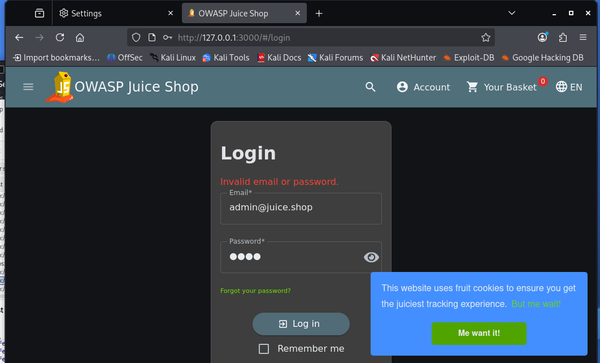

Desde Burp, en la pestaña **Proxy > HTTP history**, se identifica dicha petición (`POST /rest/user/login`, con código de respuesta `401 Unauthorized`) y se la envía a **Repeater** para poder modificarla y reenviarla a demanda (clic derecho sobre la petición --> *Send to Repeater*):

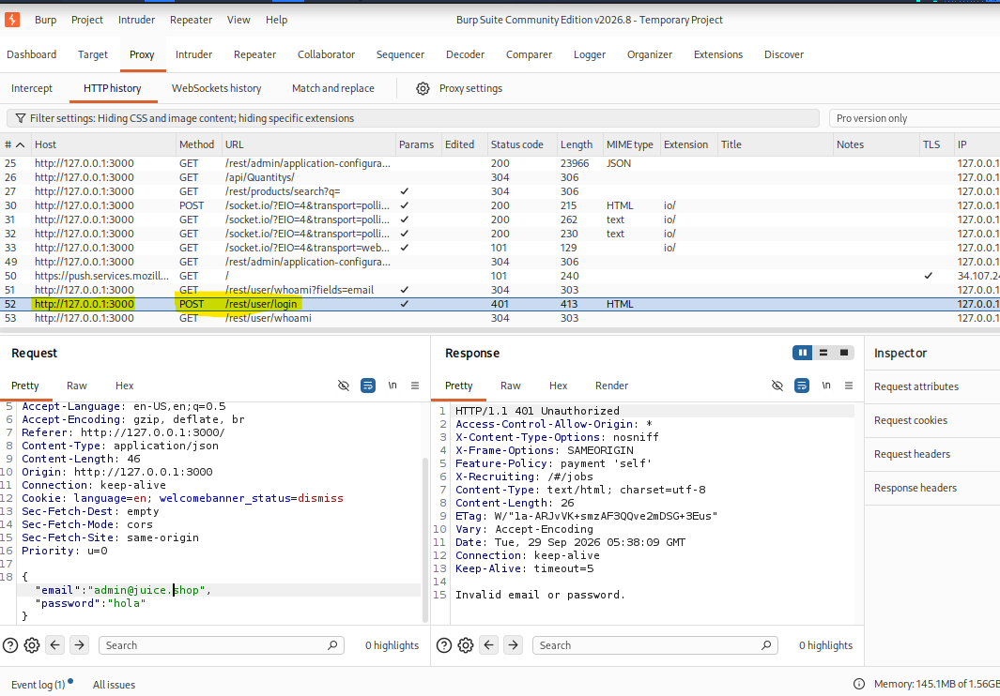

2. En Repeater, en el campo `email` del cuerpo de la petición, reemplazar el valor por un payload de inyección SQL que cierre la cadena original, fuerce una condición verdadera y comente el resto de la sentencia, utilizando la condición solicitada en la consigna:

```json
   {
     "email":"' or 22=22--",
     "password":"hola"
   }
```

De esta forma, la consulta que el backend ejecuta contra la base de datos (aproximadamente `SELECT * FROM Users WHERE email = '' or 22=22-- ' AND password = '...'`) queda con una condición `WHERE` que siempre es verdadera, ya que `22=22` se evalúa como verdadero para todas las filas de la tabla `Users`.

3. Dejar el campo `password` con un valor arbitrario (por ejemplo `hola`), dado que el operador `--` comenta el resto de la sentencia SQL —incluida la comparación de la contraseña—, por lo que su valor deja de ser evaluado por la base de datos.

4. Reenviar la petición y verificar en la respuesta que, en lugar del `401 Unauthorized` original, se obtiene un `200 OK` con un cuerpo JSON que incluye un token de sesión (JWT) y los datos del usuario devuelto por la consulta. Dado que la condición `or 22=22` es verdadera para todas las filas, la base de datos devuelve el primer registro de la tabla `Users`, que corresponde a la cuenta de administrador (`admin@juice-sh.op`), quedando así autenticado como dicho usuario sin conocer su contraseña real.

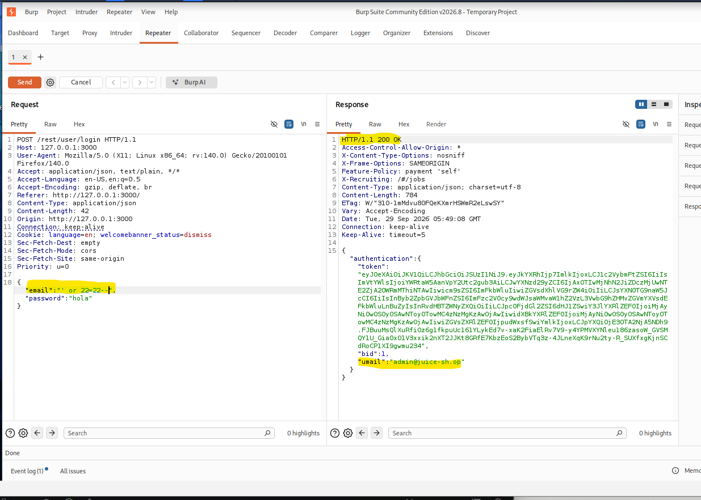

### Recomendaciones

La corrección principal de esta vulnerabilidad consiste en reemplazar la construcción de la consulta de login por consultas parametrizadas (*prepared statements*), o utilizar un ORM que las implemente internamente, de modo que los valores ingresados en los campos `email` y `password` se traten siempre como datos y nunca como parte ejecutable de la sentencia SQL, eliminando así la posibilidad de inyección. A esto conviene sumar una validación del formato del correo electrónico del lado servidor antes de usarlo en cualquier consulta, y un manejo de errores genérico en el login que no exponga mensajes internos de la base de datos capaces de facilitar a un atacante el ajuste de su payload. Por último, también es recomendable aplicar el principio de mínimo privilegio en la cuenta de base de datos que usa la aplicación e incorporar controles automatizados de seguridad (SAST/DAST) en el pipeline de CI/CD.

---
</div>

<div style="page-break-after: always;"></div>

<a name="j4---admin-registration"></a>

## J4 - Admin Registration

### Descripción

El desafío consiste en registrar un nuevo usuario, llamado "ernesto" según la consigna, con privilegios de administrador, algo que no está previsto desde la interfaz pública de registro.

### Clasificación OWASP Top 10 Web

**A01:2021 – Broken Access Control**, en su variante de *mass assignment*: el servidor no restringe qué campos del modelo de usuario puede fijar un cliente no autenticado al momento del registro.

### Enfoque de explotación

1. Interceptar con Burp la petición `POST /api/Users` que dispara el formulario público de registro.

    Cabe aclarar que el formulario de registro de Juice Shop no solicita un nombre de usuario por separado, sino únicamente correo electrónico, contraseña, pregunta de seguridad y su respuesta. Por ese motivo, el nombre "ernesto" exigido por la consigna se incorporó como parte del correo electrónico utilizado para el registro (`ernesto@admin.juiceshop`).

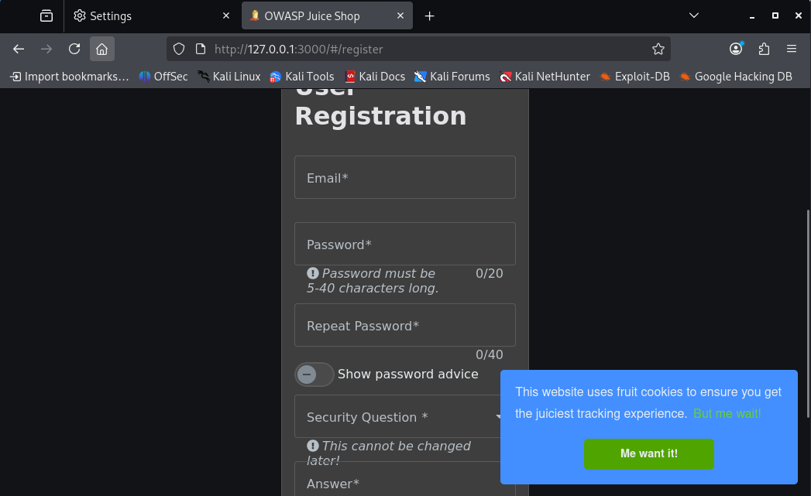

2. Completar los campos obligatorios del registro con dicho correo y una contraseña arbitraria, y enviar el formulario. Esto dispara la petición `POST /api/Users` correspondiente, visible en el historial de Burp.

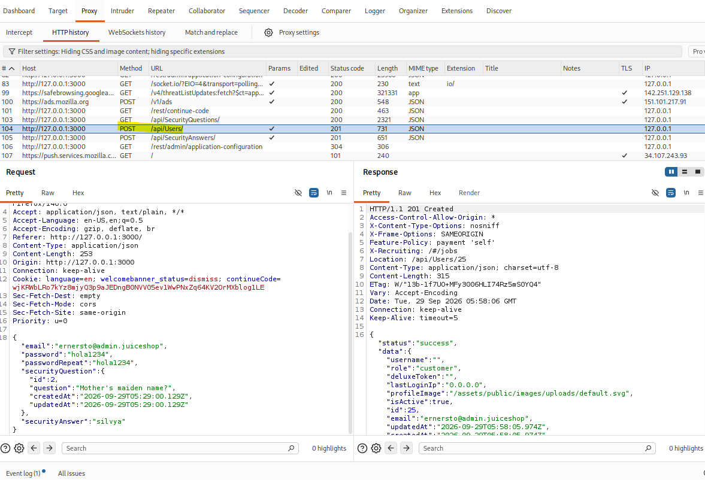

    En este punto, la petición ya se completó exitosamente en su forma original (respuesta `201 Created`), pero el usuario creado tiene el rol por defecto (`customer`), no el de administrador.


3. Enviar la petición a **Repeater** (igual que en el desafío anterior) y agregar manualmente al cuerpo JSON un campo adicional `"role": "admin"`, que no está expuesto en el formulario visible del frontend.

    Dado que el correo `ernesto@admin.juiceshop` ya había sido registrado en el paso anterior, fue necesario modificarlo levemente (`ernesto@admin1.juiceshop`) para evitar el conflicto de unicidad y poder probar la inyección del campo `role` en un registro nuevo.

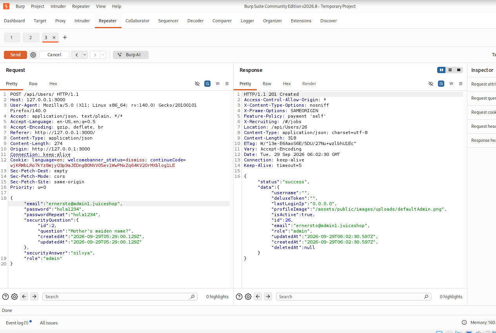

4. Reenviar la petición desde Repeater y verificar en la respuesta que el usuario fue creado con `"role":"admin"` (en lugar del valor por defecto `customer`). Finalmente, se confirma el privilegio obtenido iniciando sesión en Juice Shop con dichas credenciales: la aplicación reconoce el desafío como resuelto, mostrando el cartel de confirmación correspondiente a "Admin Registration".

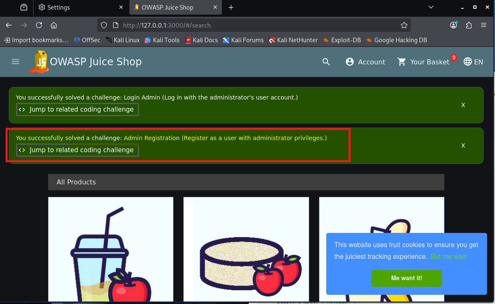

### Recomendaciones

Para corregir esta vulnerabilidad se recomienda que el backend defina de forma explícita, mediante un DTO o esquema de validación, el conjunto de campos que un cliente no autenticado puede enviar al crear un usuario, descartando o ignorando cualquier campo adicional como `role` en lugar de persistirlo tal cual llega en el cuerpo de la petición; de este modo, el rol de un usuario nuevo debería asignarse siempre del lado servidor con un valor por defecto seguro (por ejemplo `customer`), sin que el cliente tenga forma de sobrescribirlo.

Adicionalmente, la asignación o modificación de un rol con privilegios elevados como `admin` debería quedar restringida a una funcionalidad separada, accesible únicamente por usuarios ya autenticados como administradores, y quedar registrada en un log de auditoría para poder detectar intentos de escalamiento de privilegios como el descripto en este desafío.

---
</div>

<div style="page-break-after: always;"></div>

<a name="j5---user-credentials"></a>

## J5 - User Credentials

### Descripción

El desafío consiste en recuperar el listado completo de credenciales (usuarios y hashes de contraseña) almacenadas en la base de datos, explotando una inyección SQL en la barra de búsqueda de productos.

### Clasificación OWASP Top 10 Web

**A03:2021 – Injection**, específicamente una inyección SQL de tipo *UNION-based*.

### Enfoque de explotación

### Enfoque de explotación

1. Realizar una búsqueda normal de un producto (por ejemplo `apple`) desde la interfaz de Juice Shop, para identificar en Burp la petición correspondiente al buscador: `GET /rest/products/search?q=apple`.

   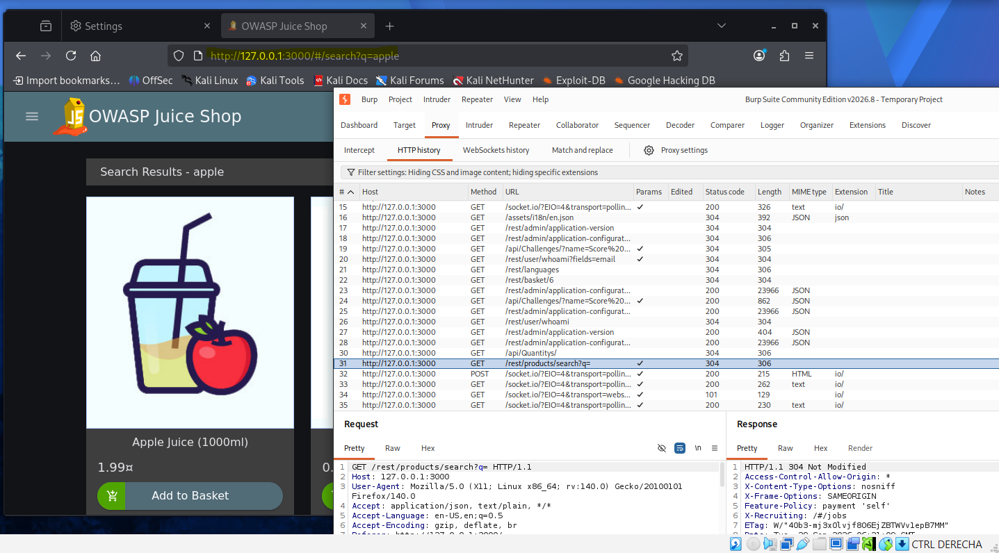

   Esta petición se envía a **Repeater**, ya que sobre ella se van a probar sucesivos payloads de forma manual.

2. Determinar, mediante prueba y error con cláusulas `ORDER BY`, la cantidad de columnas que devuelve la consulta original de búsqueda de productos. Para esto, en el parámetro `q` se prueba cerrar la condición `LIKE` y los paréntesis que arma el backend, seguido de un `ORDER BY` con un número de columna creciente (`ORDER BY 1`, `ORDER BY 2`, etc.):
`q=x')) ORDER BY 1--`
    
    Dado que el valor de `q` contiene espacios, y una petición HTTP cruda no admite espacios sin codificar en la línea de la URL, es necesario codificarlos antes de enviar la petición. En Burp esto se hace seleccionando el texto del payload dentro del Repeater y usando el atajo `Ctrl+U` (*URL-encode*), que reemplaza automáticamente los espacios y demás caracteres especiales por su forma codificada (por ejemplo, el espacio pasa a `+`).

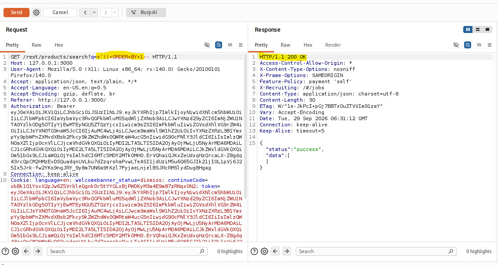

    Se repite el envío incrementando el número del `ORDER BY` en cada intento. Mientras la cantidad de columna indicada exista, la respuesta sigue siendo `200 OK`. Al llegar a `ORDER BY 10`, el servidor responde con un error `500 Internal Server Error`, indicando explícitamente que el número de columna está fuera de rango y que el valor debe estar entre 1 y 9. Esto confirma que la consulta original de búsqueda de productos tiene **9 columnas**.

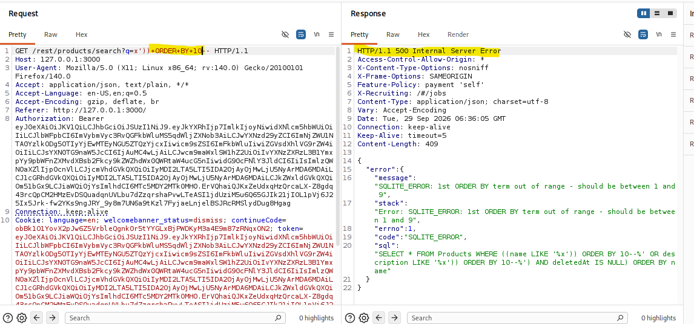

3. Con la cantidad de columnas ya conocida, se construye un payload que agregue una cláusula `UNION SELECT` de 9 columnas, apuntando a la tabla `Users` en lugar de a la de productos, ubicando `email` y `password` en las dos primeras posiciones y rellenando el resto con valores arbitrarios para no romper la cantidad de columnas del `UNION`:

    `q=x')) UNION SELECT email, password, '3','4','5','6','7','8','9' FROM Users--`

    Al igual que en el paso anterior, este payload se codifica con `Ctrl+U` antes de enviarlo desde Repeater.


4. Enviar la petición y verificar en la respuesta `200 OK` que el JSON devuelto ya no contiene únicamente productos, sino que, mezclados con la estructura esperada de un producto, aparecen los correos electrónicos de los usuarios (en el campo `id`) junto con el hash MD5 de su contraseña (en el campo `name`), mientras que el resto de los campos conserva los valores fijos indicados en el `UNION SELECT` (`'3'`, `'4'`, etc.).

   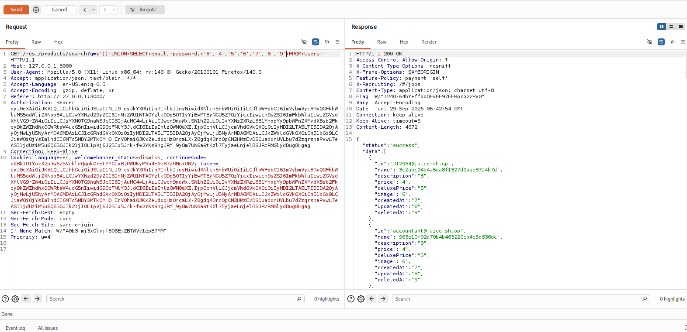

   Respuesta conseguida (fragmento):

```json
{
  "status":"success",
  "data":[
    {
      "id":"J12934@juice-sh.op",
      "name":"3c2abc04e4a6ea8f1327d0aae3714b7d",
      "description":"3",
      "price":"4",
      "deluxePrice":"5",
      "image":"6",
      "createdAt":"7",
      "updatedAt":"8",
      "deletedAt":"9"
    },
    {
      "id":"accountant@juice-sh.op",
      "name":"963e10f92a70b4b463220cb4c5d636dc",
      "description":"3",
      "price":"4",
      "deluxePrice":"5",
      "image":"6",
      "createdAt":"7",
      "updatedAt":"8",
      "deletedAt":"9"
    },
    {
      "id":"admin@juice-sh.op",
      "name":"0192023a7bbd73250516f069df18b500",
      "description":"3",
      "price":"4",
      "deluxePrice":"5",
      "image":"6",
      "createdAt":"7",
      "updatedAt":"8",
      "deletedAt":"9"
    },
    {
      "id":"amy@juice-sh.op",
      "name":"030f05e45e30710c3ad3c32f00de0473",
      "description":"3",
      "price":"4",
      "deluxePrice":"5",
      "image":"6",
      "createdAt":"7",
      "updatedAt":"8",
      "deletedAt":"9"
    },
    {
      "id":"basil@juice-sh.op",
      "name":"1d75226504523f04d2b239a7fb2990fd",
      "description":"3",
      "price":"4",
      "deluxePrice":"5",
      "image":"6",
      "createdAt":"7",
      "updatedAt":"8",
      "deletedAt":"9"
    },
    ...
  ]
}

```

### Recomendaciones

La corrección de esta vulnerabilidad pasa fundamentalmente por reemplazar la construcción de la consulta de búsqueda por consultas parametrizadas, de forma que el valor ingresado en el parámetro `q` sea tratado siempre como un dato y nunca como parte de la sentencia SQL, evitando así que pueda alterar la estructura de la consulta o agregar cláusulas como `UNION SELECT`. Además, conviene validar del lado servidor el formato esperado del término de búsqueda antes de utilizarlo, y evitar exponer en las respuestas de error los detalles internos de la base de datos (como el nombre de las tablas, la cantidad de columnas o el texto completo de la sentencia SQL fallida), ya que esa información es justamente la que permitió inferir la estructura de la consulta y construir el payload de inyección. Por último, dado que en este caso la inyección permitió acceder a contraseñas almacenadas, se recomienda también asegurar que dichas contraseñas se guarden utilizando funciones de hashing robustas y con *salt* (evitando algoritmos débiles como MD5 sin salt), de modo que aun ante una fuga de este tipo el impacto sobre las cuentas de los usuarios se vea reducido.

---
</div>

<div style="page-break-after: always;"></div>

<a name="j6---view-basket"></a>

## J6 - View Basket

### Descripción

El desafío consiste en visualizar el contenido de la cesta de compras de un usuario distinto al que se encuentra autenticado.

### Clasificación OWASP Top 10 Web

**A01:2021 – Broken Access Control**, en su variante de IDOR (*Insecure Direct Object Reference*). A diferencia de J4 (donde el problema es que el servidor acepta un campo `role` que el cliente no debería poder fijar) y de J7 (donde el problema es que un recurso oculto del catálogo sigue siendo accesible vía API), en este caso el defecto es que el endpoint de la cesta identifica el recurso únicamente mediante un identificador numérico secuencial provisto en la URL, sin verificar del lado servidor que dicho identificador pertenezca al usuario autenticado que hace la petición. Es, por lo tanto, un caso más directo de IDOR: cualquier usuario autenticado puede acceder a un recurso ajeno con solo cambiar un número.

### Enfoque de explotación

1. Iniciar sesión con una cuenta propia y agregar al menos un producto a la cesta desde la interfaz, para poder identificar en Burp el patrón del endpoint correspondiente (`GET /rest/basket/{id}`). En este caso el producto agregado fue `Apple Juice (1000ml)`.

para esta prueba se registró un nuevo usuario, aunque no es un requisito, el desafío puede reproducirse igualmente con cualquier cuenta ya existente.

```json
{
  "email": "user@basket.juiceshop",
  "password": "prueba1234"
}
```

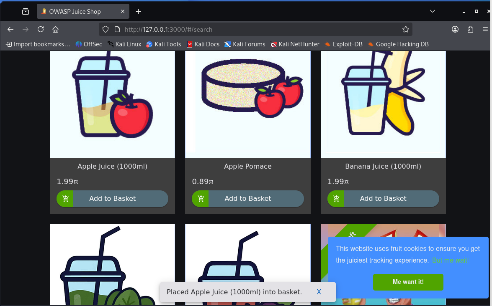

2. Ubicar en el historial de Burp la petición `GET /rest/basket/{id}` que se generó al cargar la propia cesta (en este caso, con `{id}` igual a `6`, correspondiente a la cesta del usuario recién creado) y enviarla a **Repeater** (clic derecho → *Send to Repeater*) para poder modificarla.

   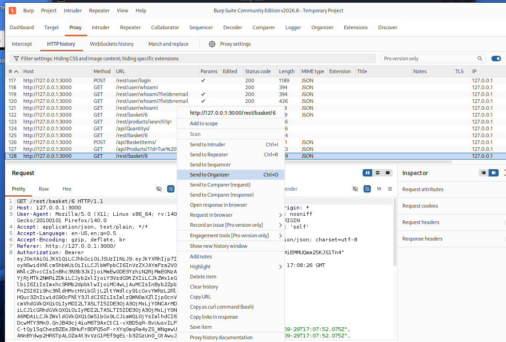

3. En Repeater, modificar manualmente el valor `{id}` de la URL por otro identificador numérico, correspondiente a la cesta de otro usuario. En este caso se probó con `{id}` igual a `1`, es decir, la cesta del primer usuario registrado en la aplicación.

4. Reenviar la petición modificada y verificar que la respuesta (`200 OK`) contiene los productos de una cesta que no pertenece al usuario autenticado. En este caso, productos que el usuario de prueba nunca agregó a su propia cesta (`Orange Juice (1000ml)` y `Eggfruit Juice (500ml)`).

   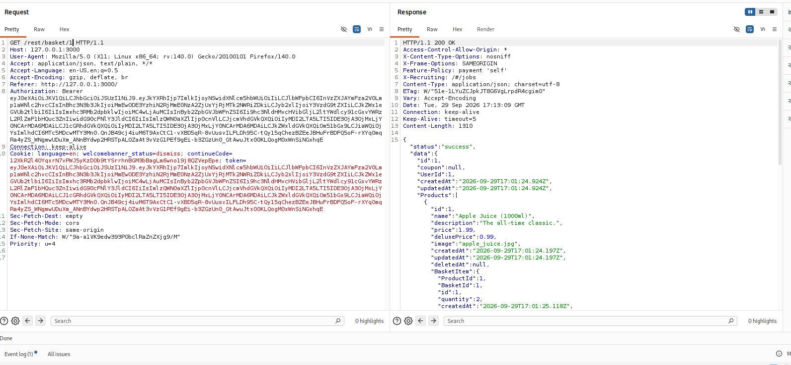

  Respuesta obtenida (fragmento relevante):

   ```json
   {
     "id":2,
     "name":"Orange Juice (1000ml)",
     "description":"Made from oranges hand-picked by Uncle Dittmeyer.",
     "price":2.99,
     "deluxePrice":2.49,
     "image":"orange_juice.jpg",
     "createdAt":"2026-09-29T17:01:24.198Z",
     "updatedAt":"2026-09-29T17:01:24.198Z",
     "deletedAt":null,
     "BasketItem":{
       "ProductId":2,
       "BasketId":1,
       "id":2,
       "quantity":3,
       "createdAt":"2026-09-29T17:01:25.118Z",
       "updatedAt":"2026-09-29T17:01:25.118Z"
     }
   },
   {
     "id":3,
     "name":"Eggfruit Juice (500ml)",
     "description":"Now with even more exotic flavour.",
     "price":8.99,
     "deluxePrice":8.99,
     "image":"eggfruit_juice.jpg",
     "createdAt":"2026-09-29T17:01:24.198Z",
     "updatedAt":"2026-09-29T17:01:24.198Z",
     "deletedAt":null,
     "BasketItem":{
       "ProductId":3,
       "BasketId":1,
       "id":3,
       "quantity":1,
       "createdAt":"2026-09-29T17:01:25.118Z",
       "updatedAt":"2026-09-29T17:01:25.118Z"
     }
   }
   ```

   La propia aplicación confirma la resolución del desafío mostrando el cartel de éxito correspondiente a "View Basket":

   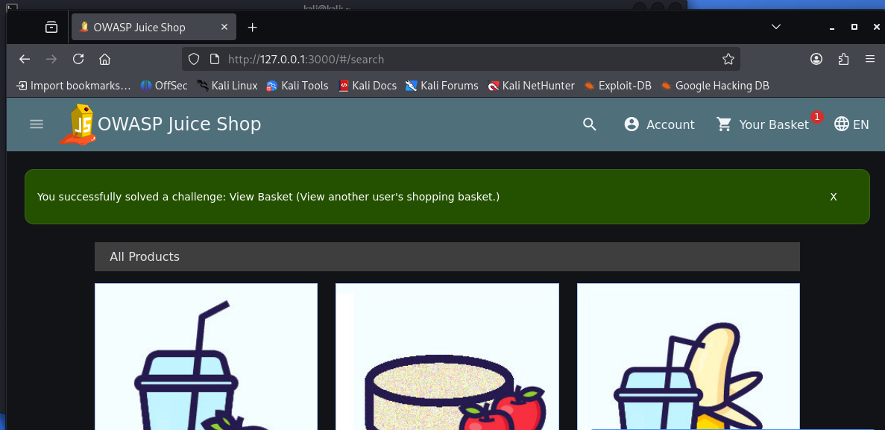

### Recomendaciones

La corrección de esta vulnerabilidad requiere agregar, en el endpoint `GET /rest/basket/{id}`, una verificación del lado servidor que confirme que el `id` de la cesta solicitada pertenece efectivamente al usuario autenticado según su token de sesión, devolviendo un error de autorización (por ejemplo `403 Forbidden`) en caso contrario, en lugar de confiar únicamente en el identificador recibido en la URL. Como medida adicional de defensa en profundidad, conviene evitar exponer identificadores internos secuenciales y fácilmente adivinables en las rutas de la API, reemplazándolos por identificadores no predecibles (como UUID) o resolviendo la cesta del usuario a partir de su sesión en vez de requerir un `id` explícito en la petición, de forma que un atacante no pueda enumerar recursos ajenos simplemente incrementando o decrementando un número.

---
</div>

<div style="page-break-after: always;"></div>

<a name="j7---christmas-special"></a>

## J7 - Christmas Special

### Descripción

El desafío consiste en comprar la oferta especial de Navidad de la edición 2014, un producto descontinuado que ya no figura en el catálogo visible de la tienda.

### Clasificación OWASP Top 10 Web

**A01:2021 – Broken Access Control**, con un componente de **A04:2021 – Insecure Design**: ocultar un producto del catálogo visual no equivale a revocar su identificador a nivel de API, que sigue siendo válido para el backend.

### Enfoque de explotación

1. Identificar el identificador (`ProductId`) del producto oculto "Christmas Special", por ejemplo revisando respuestas anteriores del endpoint `/rest/products`, el código fuente de la aplicación o referencias históricas a la promoción de 2014.
2. Construir o interceptar una petición `POST /api/BasketItems` indicando dicho `ProductId`, aunque el producto no aparezca listado en la interfaz.
3. Reenviar la petición y confirmar que el producto fue agregado exitosamente a la cesta pese a no estar disponible en el catálogo visible.
4. Completar el flujo de compra para validar el desafío.

### Recomendaciones

Algunas recomendaciones para la corrección de dicha vulnerabilidad podría incluir...

---
</div>

---
</div>

<!-- ============================================================ -->
<!-- Desafíos crAPI -->
<!-- ============================================================ -->

<div style="page-break-after: always;"></div>

<a name="desafíos-crapi"></a>

## Desafíos crAPI

Para esta parte, se explotarán y documentarán cinco debilidades representativas del OWASP API Security Top 10.

* [C1 - Find the location of another user's vehicle](#c1---find-the-location-of-another-users-vehicle)
* [C2 - Reset the password of a different user](#c2---reset-the-password-of-a-different-user)
* [C3 - Get an item for free](#c3---get-an-item-for-free)
* [C6 - NoSQL Injection](#c6---nosql-injection)
* [C7 - DoS](#c7---dos)

<div style="page-break-after: always;"></div>

<a name="c1---find-the-location-of-another-users-vehicle"></a>

## C1 - Find the location of another user's vehicle

### Descripción

El desafío consiste en obtener información sensible de ubicación (geolocalización) del vehículo de otro usuario de la plataforma.

### Clasificación OWASP Top 10 API

**API1:2023 – Broken Object Level Authorization (BOLA).** El endpoint que devuelve la ubicación de un vehículo confía en un identificador (VIN) provisto por el propio cliente, sin validar del lado servidor que ese vehículo pertenezca al usuario autenticado.

### Enfoque de explotación

1. Iniciar sesión y capturar con Burp la petición legítima que consulta la ubicación del propio vehículo, identificando el microservicio y el formato de la petición.
2. Obtener el VIN de otro usuario, por ejemplo a través de la funcionalidad de foro/comunidad de crAPI, donde suelen compartirse datos de vehículos entre usuarios.
3. Reemplazar el VIN propio por el de la víctima en la petición interceptada.
4. Reenviar la petición modificada y confirmar que la respuesta contiene la ubicación del vehículo ajeno.

### Recomendaciones

Algunas recomendaciones para la corrección de dicha vulnerabilidad podría incluir...

---
</div>

<div style="page-break-after: always;"></div>

<a name="c2---reset-the-password-of-a-different-user"></a>

## C2 - Reset the password of a different user

### Descripción

El desafío consiste en forzar el cambio de contraseña de la cuenta de otro usuario, abusando del flujo de recuperación de contraseña.

### Clasificación OWASP Top 10 API

**API2:2023 – Broken Authentication.** El flujo de recuperación no vincula correctamente el código de verificación (OTP) con el correo electrónico sobre el cual se solicita el cambio, y/o no limita los intentos de verificación de dicho código.

### Enfoque de explotación

1. Disparar el flujo de "Forgot Password" dos veces desde Burp: una con el correo propio y otra con el correo de la víctima, comparando ambas peticiones.
2. Analizar cómo se relacionan, en el cuerpo de la petición de confirmación, el campo del correo electrónico y el del OTP recibido.
3. Ajustar la petición de confirmación de cambio de contraseña para que el campo de correo corresponda al de la víctima, aprovechando la falla identificada en la verificación del OTP.
4. Reenviar la petición y confirmar el cambio iniciando sesión con la nueva contraseña sobre la cuenta de la víctima.

### Recomendaciones

Algunas recomendaciones para la corrección de dicha vulnerabilidad podría incluir...

---
</div>

<div style="page-break-after: always;"></div>

<a name="c3---get-an-item-for-free"></a>

## C3 - Get an item for free

### Descripción

El desafío consiste en obtener un reembolso o crédito superior al monto realmente abonado al procesar la devolución de un producto.

### Clasificación OWASP Top 10 API

**API6:2023 – Unrestricted Access to Sensitive Business Flows.** El flujo de devolución/reembolso no valida límites de cantidad ni impide que una misma operación se repita para la misma orden.

### Enfoque de explotación

1. Realizar una compra y capturar con Burp la petición `POST` correspondiente al flujo de devolución de dicho producto.
2. Analizar los parámetros de cantidad y monto presentes en el cuerpo de la petición.
3. Reenviar la misma petición en repetidas ocasiones (*replay*) y/o alterar el valor de cantidad, observando si el sistema acumula reembolsos sin control.
4. Verificar en el saldo o cupón de la cuenta que el monto obtenido supera al efectivamente pagado.

### Recomendaciones

Algunas recomendaciones para la corrección de dicha vulnerabilidad podría incluir...

---
</div>

<div style="page-break-after: always;"></div>

<a name="c6---nosql-injection"></a>

## C6 - NoSQL Injection

### Descripción

El desafío consiste en obtener cupones de descuento válidos sin conocer un código real, explotando una inyección en la consulta que valida el cupón contra la base de datos NoSQL (MongoDB).

### Clasificación OWASP Top 10 API

**API8:2019 – Injection**, categoría explícita en la edición 2019 del OWASP API Security Top 10 (en la edición 2023 el aspecto de validación insegura de la entrada se asocia principalmente a **API8:2023 – Security Misconfiguration**). El parámetro que recibe el código de cupón se pasa directamente a una consulta MongoDB sin sanitizar, permitiendo inyectar operadores propios de NoSQL en lugar de una cadena literal.

### Enfoque de explotación

1. Interceptar con Burp la petición que aplica un cupón durante el checkout de crAPI.
2. Probar primero con el código indicado por la consigna, `1893Carbonero First`, para confirmar el comportamiento normal ante un cupón inexistente.
3. Reemplazar el valor del campo del código de cupón por un objeto u operador de inyección NoSQL (por ejemplo, forzando una condición que la base de datos evalúe siempre como verdadera) en lugar de una cadena literal.
4. Reenviar la petición y verificar que el cupón es aceptado como válido sin necesidad de conocer un código real.

### Recomendaciones

Algunas recomendaciones para la corrección de dicha vulnerabilidad podría incluir...

---
</div>

<div style="page-break-after: always;"></div>

<a name="c7---dos"></a>

## C7 - DoS

### Descripción

El desafío consiste en provocar una denegación de servicio de capa 7 (aplicación) utilizando la funcionalidad de "contact mechanic".

### Clasificación OWASP Top 10 API

**API4:2023 – Unrestricted Resource Consumption.** El endpoint que procesa el mensaje al mecánico no implementa límites de frecuencia (*rate limiting*) ni de tamaño de payload, y dispara una operación costosa en el backend en cada invocación.

### Enfoque de explotación

1. Capturar con Burp la petición `POST` correspondiente al envío de un mensaje de contacto al mecánico.
2. Identificar si el cuerpo de la petición admite payloads de gran tamaño (por ejemplo, un campo de texto sin límite definido) y si existe algún control de frecuencia de envíos.
3. Automatizar el reenvío masivo de dicha petición, eventualmente con payloads de gran tamaño, utilizando herramientas como Burp Intruder o un script propio.
4. Monitorear el estado del servicio (tiempos de respuesta, disponibilidad, uso de recursos) para verificar la degradación o caída provocada.

### Recomendaciones

Algunas recomendaciones para la corrección de dicha vulnerabilidad podría incluir...

---
</div>

---
</div>

</div>

<div style="page-break-after: always;"></div>

<a name="conclusiones"></a>

## Conclusiones

---
</div>

> Belén Kanas | Desarrollo de Software Seguro 2026
