<!-- ============================================================ -->
<!-- CARÁTULA -->
<!-- ============================================================ -->

<div align="center">

# Universidad Católica del Uruguay

### Desarrollo de Software Seguro

# Práctico 3 - OWASP Juice Shop y OWASP crAPI


**Belén Kanas** 

**Profesores:** 

Wiler Alvez

Nicolás Piquerez

Alejandro Piccardo

Leonardo Conde

**10 de Octubre de 2026**

----------
</div>


<div style="page-break-after: always;"></div>

<!-- ============================================================ -->
<!-- Índice -->
<!-- ============================================================ -->

<div align="justify">

## Índice

* [Introducción](#introduccion)
* [Desafíos Juice Shop](#desafíos-juice-shop)
* [Desafíos crAPI](#desafíos-crapi)
* [Conclusiones](#conclusiones)


----------
</div>


<div style="page-break-after: always;"></div>

<a name="introduccion"></a>

## Introducción

El objetivo de este práctico es identificar, explotar y documentar vulnerabilidades representativas del OWASP Top 10 Web y del OWASP Top 10 API, utilizando dos aplicaciones deliberadamente inseguras provistas para tal fin:

* **OWASP Juice Shop**: una aplicación web de e-commerce que contiene, de forma intencional, vulnerabilidades representativas de las categorías del OWASP Top 10 Web (inyección, control de acceso roto, diseño inseguro, entre otras).
* **OWASP crAPI ("Completely Ridiculous API")**: una aplicación basada en microservicios con un uso extensivo de APIs REST, pensada específicamente para ilustrar las debilidades recogidas en el OWASP API Security Top 10.

De acuerdo con la consigna, se seleccionaron cinco desafíos de cada aplicación. En Juice Shop se trabajó sobre:

* **J2 – Login Admin**
* **J4 – Admin Registration**
* **J5 – User Credentials**
* **J6 – View Basket**
* **J7 – Christmas Special**

En crAPI se trabajó sobre:

* **C1 – Find the location of another user's vehicle**
* **C2 – Reset the password of a different user**
* **C3 – Get an item for free**
* **C6 – NoSQL Injection**
* **C7 – DoS**

Para cada uno de estos desafíos se describe en qué consiste el defecto que lo hace posible, se lo clasifica dentro de la categoría del OWASP Top 10 (Web o API, según corresponda) que se considera más apropiada, y se detalla el enfoque general para su explotación.

> **Aclaración:** Para la realización de este práctico se recomienda haber completado previamente la instalación del entorno de trabajo detallada en el [Práctico 1](https://github.com/belenkanas/dsws-practico1.git). Puntualmente, se trabaja desde una máquina virtual Kali Linux (desplegada en Oracle VirtualBox), utilizando BurpSuite como proxy de intercepción del tráfico del navegador, y contenedores Docker (orquestados con Docker Compose) para levantar las aplicaciones OWASP Juice Shop y OWASP crAPI.

---
</div>

<!-- ============================================================ -->
<!-- Desafíos Juice Shop -->
<!-- ============================================================ -->


<div style="page-break-after: always;"></div>

<a name="desafíos-juice-shop"></a>

## Desafíos Juice Shop

Para esta parte, se explotarán y documentarán cinco debilidades representativas del OWASP Top 10 Web. 

Especialemente, se trabajará con las siguientes debilidades:

* [J2 - Login Admin](#j2---login-admin)
* [J4 - Admin Registration](#j4---admin-registration)
* [J5 - User Credentials](#j5---user-credentials)
* [J6 - View Basket](#j6---view-basket)
* [J7 - Christmas Special](#j7---christmas-special)

<div style="page-break-after: always;"></div>

<a name="j2---login-admin"></a>

## J2 - Login Admin

### Descripción

El desafío consiste en iniciar sesión como el usuario administrador de la tienda sin conocer su contraseña, explotando una falla de inyección SQL presente en el formulario de login.

### Clasificación OWASP Top 10 Web

**A03:2021 – Injection.** El backend concatena directamente el valor ingresado por el usuario en la consulta SQL utilizada para validar las credenciales, en lugar de emplear consultas parametrizadas, lo que permite alterar la lógica de la cláusula `WHERE`.

### Enfoque de explotación

Una vez levantado el contenedor correspondiente a OWASP Juice Shop (con el comando `docker run --detach -p 3000:3000 bkimminich/juice-shop`) y con el proxy de intercepción en ejecución, se realizaron los siguientes pasos:

1. Interceptar con BurpSuite la petición `POST /rest/user/login` que dispara el formulario de inicio de sesión.

Una vez ingresado en Juice Shop, se intenta iniciar sesión con una cuenta arbitraria (por ejemplo `admin@juice.shop` / `hola`), lo cual dispara la petición HTTP correspondiente hacia el proxy de intercepción.


Desde Burp, en la pestaña **Proxy > HTTP history**, se identifica dicha petición (`POST /rest/user/login`, con código de respuesta `401 Unauthorized`) y se la envía a **Repeater** para poder modificarla y reenviarla a demanda (clic derecho sobre la petición --> *Send to Repeater*):


2. En Repeater, en el campo `email` del cuerpo de la petición, reemplazar el valor por un payload de inyección SQL que cierre la cadena original, fuerce una condición verdadera y comente el resto de la sentencia, utilizando la condición solicitada en la consigna:

```json
   {
     "email":"' or 22=22--",
     "password":"hola"
   }
```

De esta forma, la consulta que el backend ejecuta contra la base de datos (aproximadamente `SELECT * FROM Users WHERE email = '' or 22=22-- ' AND password = '...'`) queda con una condición `WHERE` que siempre es verdadera, ya que `22=22` se evalúa como verdadero para todas las filas de la tabla `Users`.

3. Dejar el campo `password` con un valor arbitrario (por ejemplo `hola`), dado que el operador `--` comenta el resto de la sentencia SQL —incluida la comparación de la contraseña—, por lo que su valor deja de ser evaluado por la base de datos.

4. Reenviar la petición y verificar en la respuesta que, en lugar del `401 Unauthorized` original, se obtiene un `200 OK` con un cuerpo JSON que incluye un token de sesión (JWT) y los datos del usuario devuelto por la consulta. Dado que la condición `or 22=22` es verdadera para todas las filas, la base de datos devuelve el primer registro de la tabla `Users`, que corresponde a la cuenta de administrador (`admin@juice-sh.op`), quedando así autenticado como dicho usuario sin conocer su contraseña real.


### Recomendaciones

La corrección principal de esta vulnerabilidad consiste en reemplazar la construcción de la consulta de login por consultas parametrizadas (*prepared statements*), o utilizar un ORM que las implemente internamente, de modo que los valores ingresados en los campos `email` y `password` se traten siempre como datos y nunca como parte ejecutable de la sentencia SQL, eliminando así la posibilidad de inyección. A esto conviene sumar una validación del formato del correo electrónico del lado servidor antes de usarlo en cualquier consulta, y un manejo de errores genérico en el login que no exponga mensajes internos de la base de datos capaces de facilitar a un atacante el ajuste de su payload. Por último, también es recomendable aplicar el principio de mínimo privilegio en la cuenta de base de datos que usa la aplicación e incorporar controles automatizados de seguridad (SAST/DAST) en el pipeline de CI/CD.

---
</div>

<div style="page-break-after: always;"></div>

<a name="j4---admin-registration"></a>

## J4 - Admin Registration

### Descripción

El desafío consiste en registrar un nuevo usuario, llamado "ernesto" según la consigna, con privilegios de administrador, algo que no está previsto desde la interfaz pública de registro.

### Clasificación OWASP Top 10 Web

**A01:2021 – Broken Access Control**, en su variante de *mass assignment*: el servidor no restringe qué campos del modelo de usuario puede fijar un cliente no autenticado al momento del registro.

### Enfoque de explotación

1. Interceptar con Burp la petición `POST /api/Users` que dispara el formulario público de registro.

    Cabe aclarar que el formulario de registro de Juice Shop no solicita un nombre de usuario por separado, sino únicamente correo electrónico, contraseña, pregunta de seguridad y su respuesta. Por ese motivo, el nombre "ernesto" exigido por la consigna se incorporó como parte del correo electrónico utilizado para el registro (`ernesto@admin.juiceshop`).


2. Completar los campos obligatorios del registro con dicho correo y una contraseña arbitraria, y enviar el formulario. Esto dispara la petición `POST /api/Users` correspondiente, visible en el historial de Burp.


    En este punto, la petición ya se completó exitosamente en su forma original (respuesta `201 Created`), pero el usuario creado tiene el rol por defecto (`customer`), no el de administrador.


3. Enviar la petición a **Repeater** (igual que en el desafío anterior) y agregar manualmente al cuerpo JSON un campo adicional `"role": "admin"`, que no está expuesto en el formulario visible del frontend.

    Dado que el correo `ernesto@admin.juiceshop` ya había sido registrado en el paso anterior, fue necesario modificarlo levemente (`ernesto@admin1.juiceshop`) para evitar el conflicto de unicidad y poder probar la inyección del campo `role` en un registro nuevo.


4. Reenviar la petición desde Repeater y verificar en la respuesta que el usuario fue creado con `"role":"admin"` (en lugar del valor por defecto `customer`). Finalmente, se confirma el privilegio obtenido iniciando sesión en Juice Shop con dichas credenciales: la aplicación reconoce el desafío como resuelto, mostrando el cartel de confirmación correspondiente a "Admin Registration".


### Recomendaciones

Para corregir esta vulnerabilidad se recomienda que el backend defina de forma explícita, mediante un DTO o esquema de validación, el conjunto de campos que un cliente no autenticado puede enviar al crear un usuario, descartando o ignorando cualquier campo adicional como `role` en lugar de persistirlo tal cual llega en el cuerpo de la petición; de este modo, el rol de un usuario nuevo debería asignarse siempre del lado servidor con un valor por defecto seguro (por ejemplo `customer`), sin que el cliente tenga forma de sobrescribirlo.

Adicionalmente, la asignación o modificación de un rol con privilegios elevados como `admin` debería quedar restringida a una funcionalidad separada, accesible únicamente por usuarios ya autenticados como administradores, y quedar registrada en un log de auditoría para poder detectar intentos de escalamiento de privilegios como el descripto en este desafío.

---
</div>

<div style="page-break-after: always;"></div>

<a name="j5---user-credentials"></a>

## J5 - User Credentials

### Descripción

El desafío consiste en recuperar el listado completo de credenciales (usuarios y hashes de contraseña) almacenadas en la base de datos, explotando una inyección SQL en la barra de búsqueda de productos.

### Clasificación OWASP Top 10 Web

**A03:2021 – Injection**, específicamente una inyección SQL de tipo *UNION-based*.

### Enfoque de explotación

### Enfoque de explotación

1. Realizar una búsqueda normal de un producto (por ejemplo `apple`) desde la interfaz de Juice Shop, para identificar en Burp la petición correspondiente al buscador: `GET /rest/products/search?q=apple`.

   

   Esta petición se envía a **Repeater**, ya que sobre ella se van a probar sucesivos payloads de forma manual.

2. Determinar, mediante prueba y error con cláusulas `ORDER BY`, la cantidad de columnas que devuelve la consulta original de búsqueda de productos. Para esto, en el parámetro `q` se prueba cerrar la condición `LIKE` y los paréntesis que arma el backend, seguido de un `ORDER BY` con un número de columna creciente (`ORDER BY 1`, `ORDER BY 2`, etc.):
`q=x')) ORDER BY 1--`
    
    Dado que el valor de `q` contiene espacios, y una petición HTTP cruda no admite espacios sin codificar en la línea de la URL, es necesario codificarlos antes de enviar la petición. En Burp esto se hace seleccionando el texto del payload dentro del Repeater y usando el atajo `Ctrl+U` (*URL-encode*), que reemplaza automáticamente los espacios y demás caracteres especiales por su forma codificada (por ejemplo, el espacio pasa a `+`).


    Se repite el envío incrementando el número del `ORDER BY` en cada intento. Mientras la cantidad de columna indicada exista, la respuesta sigue siendo `200 OK`. Al llegar a `ORDER BY 10`, el servidor responde con un error `500 Internal Server Error`, indicando explícitamente que el número de columna está fuera de rango y que el valor debe estar entre 1 y 9. Esto confirma que la consulta original de búsqueda de productos tiene **9 columnas**.


3. Con la cantidad de columnas ya conocida, se construye un payload que agregue una cláusula `UNION SELECT` de 9 columnas, apuntando a la tabla `Users` en lugar de a la de productos, ubicando `email` y `password` en las dos primeras posiciones y rellenando el resto con valores arbitrarios para no romper la cantidad de columnas del `UNION`:

    `q=x')) UNION SELECT email, password, '3','4','5','6','7','8','9' FROM Users--`

    Al igual que en el paso anterior, este payload se codifica con `Ctrl+U` antes de enviarlo desde Repeater.


4. Enviar la petición y verificar en la respuesta `200 OK` que el JSON devuelto ya no contiene únicamente productos, sino que, mezclados con la estructura esperada de un producto, aparecen los correos electrónicos de los usuarios (en el campo `id`) junto con el hash MD5 de su contraseña (en el campo `name`), mientras que el resto de los campos conserva los valores fijos indicados en el `UNION SELECT` (`'3'`, `'4'`, etc.).

   

   Respuesta conseguida (fragmento):

```json
{
  "status":"success",
  "data":[
    {
      "id":"J12934@juice-sh.op",
      "name":"3c2abc04e4a6ea8f1327d0aae3714b7d",
      "description":"3",
      "price":"4",
      "deluxePrice":"5",
      "image":"6",
      "createdAt":"7",
      "updatedAt":"8",
      "deletedAt":"9"
    },
    {
      "id":"accountant@juice-sh.op",
      "name":"963e10f92a70b4b463220cb4c5d636dc",
      "description":"3",
      "price":"4",
      "deluxePrice":"5",
      "image":"6",
      "createdAt":"7",
      "updatedAt":"8",
      "deletedAt":"9"
    },
    {
      "id":"admin@juice-sh.op",
      "name":"0192023a7bbd73250516f069df18b500",
      "description":"3",
      "price":"4",
      "deluxePrice":"5",
      "image":"6",
      "createdAt":"7",
      "updatedAt":"8",
      "deletedAt":"9"
    },
    {
      "id":"amy@juice-sh.op",
      "name":"030f05e45e30710c3ad3c32f00de0473",
      "description":"3",
      "price":"4",
      "deluxePrice":"5",
      "image":"6",
      "createdAt":"7",
      "updatedAt":"8",
      "deletedAt":"9"
    },
    {
      "id":"basil@juice-sh.op",
      "name":"1d75226504523f04d2b239a7fb2990fd",
      "description":"3",
      "price":"4",
      "deluxePrice":"5",
      "image":"6",
      "createdAt":"7",
      "updatedAt":"8",
      "deletedAt":"9"
    },
    ...
  ]
}

```

### Recomendaciones

La corrección de esta vulnerabilidad pasa fundamentalmente por reemplazar la construcción de la consulta de búsqueda por consultas parametrizadas, de forma que el valor ingresado en el parámetro `q` sea tratado siempre como un dato y nunca como parte de la sentencia SQL, evitando así que pueda alterar la estructura de la consulta o agregar cláusulas como `UNION SELECT`. Además, conviene validar del lado servidor el formato esperado del término de búsqueda antes de utilizarlo, y evitar exponer en las respuestas de error los detalles internos de la base de datos (como el nombre de las tablas, la cantidad de columnas o el texto completo de la sentencia SQL fallida), ya que esa información es justamente la que permitió inferir la estructura de la consulta y construir el payload de inyección. Por último, dado que en este caso la inyección permitió acceder a contraseñas almacenadas, se recomienda también asegurar que dichas contraseñas se guarden utilizando funciones de hashing robustas y con *salt* (evitando algoritmos débiles como MD5 sin salt), de modo que aun ante una fuga de este tipo el impacto sobre las cuentas de los usuarios se vea reducido.

---
</div>

<div style="page-break-after: always;"></div>

<a name="j6---view-basket"></a>

## J6 - View Basket

### Descripción

El desafío consiste en visualizar el contenido de la cesta de compras de un usuario distinto al que se encuentra autenticado.

### Clasificación OWASP Top 10 Web

**A01:2021 – Broken Access Control**, en su variante de IDOR (*Insecure Direct Object Reference*). A diferencia de J4 (donde el problema es que el servidor acepta un campo `role` que el cliente no debería poder fijar) y de J7 (donde el problema es que un recurso oculto del catálogo sigue siendo accesible vía API), en este caso el defecto es que el endpoint de la cesta identifica el recurso únicamente mediante un identificador numérico secuencial provisto en la URL, sin verificar del lado servidor que dicho identificador pertenezca al usuario autenticado que hace la petición. Es, por lo tanto, un caso más directo de IDOR: cualquier usuario autenticado puede acceder a un recurso ajeno con solo cambiar un número.

### Enfoque de explotación

1. Iniciar sesión con una cuenta propia y agregar al menos un producto a la cesta desde la interfaz, para poder identificar en Burp el patrón del endpoint correspondiente (`GET /rest/basket/{id}`). En este caso el producto agregado fue `Apple Juice (1000ml)`.

para esta prueba se registró un nuevo usuario, aunque no es un requisito, el desafío puede reproducirse igualmente con cualquier cuenta ya existente.

```json
{
  "email": "user@basket.juiceshop",
  "password": "prueba1234"
}
```


2. Ubicar en el historial de Burp la petición `GET /rest/basket/{id}` que se generó al cargar la propia cesta (en este caso, con `{id}` igual a `6`, correspondiente a la cesta del usuario recién creado) y enviarla a **Repeater** (clic derecho → *Send to Repeater*) para poder modificarla.

   

3. En Repeater, modificar manualmente el valor `{id}` de la URL por otro identificador numérico, correspondiente a la cesta de otro usuario. En este caso se probó con `{id}` igual a `1`, es decir, la cesta del primer usuario registrado en la aplicación.

4. Reenviar la petición modificada y verificar que la respuesta (`200 OK`) contiene los productos de una cesta que no pertenece al usuario autenticado. En este caso, productos que el usuario de prueba nunca agregó a su propia cesta (`Orange Juice (1000ml)` y `Eggfruit Juice (500ml)`).

   

  Respuesta obtenida (fragmento relevante):

   ```json
   {
     "id":2,
     "name":"Orange Juice (1000ml)",
     "description":"Made from oranges hand-picked by Uncle Dittmeyer.",
     "price":2.99,
     "deluxePrice":2.49,
     "image":"orange_juice.jpg",
     "createdAt":"2026-09-29T17:01:24.198Z",
     "updatedAt":"2026-09-29T17:01:24.198Z",
     "deletedAt":null,
     "BasketItem":{
       "ProductId":2,
       "BasketId":1,
       "id":2,
       "quantity":3,
       "createdAt":"2026-09-29T17:01:25.118Z",
       "updatedAt":"2026-09-29T17:01:25.118Z"
     }
   },
   {
     "id":3,
     "name":"Eggfruit Juice (500ml)",
     "description":"Now with even more exotic flavour.",
     "price":8.99,
     "deluxePrice":8.99,
     "image":"eggfruit_juice.jpg",
     "createdAt":"2026-09-29T17:01:24.198Z",
     "updatedAt":"2026-09-29T17:01:24.198Z",
     "deletedAt":null,
     "BasketItem":{
       "ProductId":3,
       "BasketId":1,
       "id":3,
       "quantity":1,
       "createdAt":"2026-09-29T17:01:25.118Z",
       "updatedAt":"2026-09-29T17:01:25.118Z"
     }
   }
   ```

   La propia aplicación confirma la resolución del desafío mostrando el cartel de éxito correspondiente a "View Basket":

   

### Recomendaciones

La corrección de esta vulnerabilidad requiere agregar, en el endpoint `GET /rest/basket/{id}`, una verificación del lado servidor que confirme que el `id` de la cesta solicitada pertenece efectivamente al usuario autenticado según su token de sesión, devolviendo un error de autorización (por ejemplo `403 Forbidden`) en caso contrario, en lugar de confiar únicamente en el identificador recibido en la URL. Como medida adicional de defensa en profundidad, conviene evitar exponer identificadores internos secuenciales y fácilmente adivinables en las rutas de la API, reemplazándolos por identificadores no predecibles (como UUID) o resolviendo la cesta del usuario a partir de su sesión en vez de requerir un `id` explícito en la petición, de forma que un atacante no pueda enumerar recursos ajenos simplemente incrementando o decrementando un número.

---
</div>

<div style="page-break-after: always;"></div>

<a name="j7---christmas-special"></a>

## J7 - Christmas Special

### Descripción

El desafío consiste en comprar la oferta especial de Navidad de la edición 2014, un producto descontinuado que ya no figura en el catálogo visible de la tienda.

### Clasificación OWASP Top 10 Web

**A01:2021 – Broken Access Control**, con un componente de **A04:2021 – Insecure Design**: ocultar un producto del catálogo visual no equivale a revocar su identificador a nivel de API, que sigue siendo válido para el backend.

### Enfoque de explotación

### Enfoque de explotación

1. Buscar `christmas` desde la barra de búsqueda de Juice Shop, lo cual no arroja resultados (`http://127.0.0.1:3000/#/search?q=christmas`), confirmando que el producto no está disponible en el catálogo visible.

   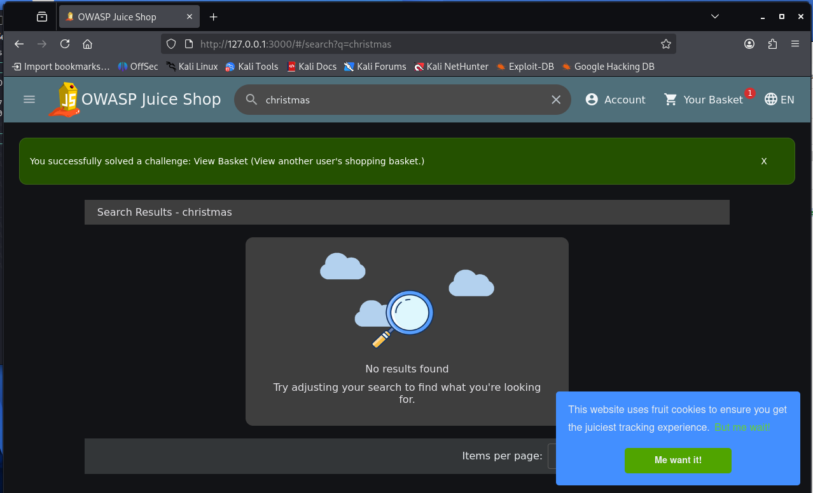

2. Enviar dicha petición (`GET /rest/products/search?q=`) a Repeater e inyectar en el parámetro `q` un payload que cierre la condición `LIKE` original y comente el resto de la consulta, incluyendo el filtro `AND deletedAt IS NULL` que es el que excluye a los productos dados de baja. 

  A diferencia de J5, acá no se agrega un `UNION SELECT`: alcanza con truncar la consulta antes de que se aplique dicho filtro, para que devuelva cualquier producto cuyo nombre o descripción coincida con el término buscado, esté o no marcado como eliminado:

  `GET /rest/products/search?q=christmas%25'))+--`

  Es importante incluir el símbolo `%` antes de la comilla de cierre, ya que la consulta original arma la condición como `LIKE '%<query>%'`; sin ese `%`, la condición pasaría a exigir que el campo *termine* exactamente en el texto buscado, en lugar de *contenerlo*, lo que impide encontrar el producto (cuyo nombre real no termina en "christmas").

  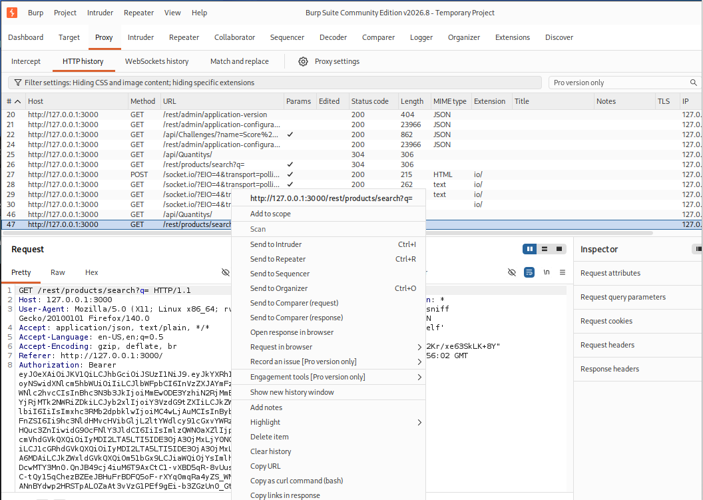

3. Al enviar la petición, la respuesta ya no viene vacía: aparece un producto con `id: 10`, `deletedAt` con una fecha (en lugar de `null`) y una descripción que confirma que se trata de la promoción buscada. Este `id` es el `ProductId` que se va a usar para agregarlo a la cesta.

   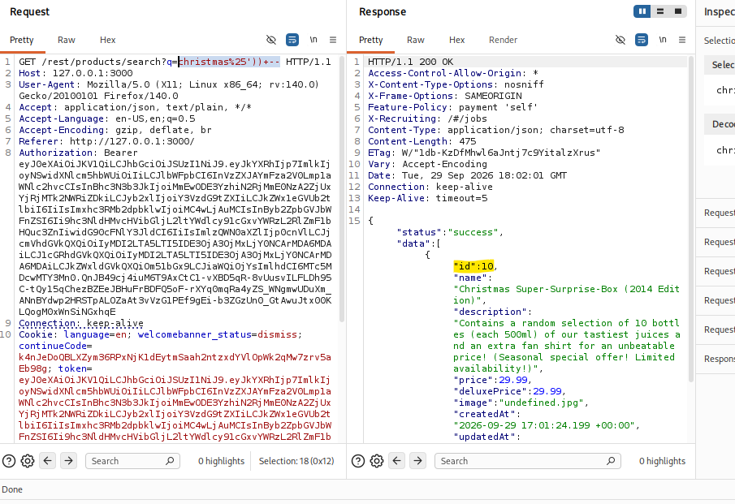

   Información de la promoción obtenida (fragmento):

  ```json
  {
    "status":"success",
    "data":[
      {
        "id":10,
        "name":"Christmas Super-Surprise-Box (2014 Edition)",
        "description":"Contains a random selection of 10 bottles (each 500ml) of our tastiest juices and an extra fan shirt for an unbeatable price! (Seasonal special offer! Limited availability!)",
        "price":29.99,
        "deluxePrice":29.99,
        "image":"undefined.jpg",
        "createdAt":"2026-09-29 17:01:24.199 +00:00",
        "updatedAt":"2026-09-29 17:01:24.199 +00:00",
        "deletedAt":"2026-09-29 17:01:24.337 +00:00"
      }
    ]
  }
  ```

4. Dado que el producto no está en el catálogo visible, no existe un botón "Add to Basket" para él en la interfaz. Por eso, se arma manualmente en Burp una petición `POST /api/BasketItems` con el `ProductId` obtenido y el `BasketId` de la propia cesta del usuario autenticado:

  Cuerpo de la petición con el id correspondiente:

  HTTP Request: `POST /api/BasketItems/`
  Body:

  ```json
  { "ProductId":10,
    "BasketId":"6",
    "quantity":1
  }
  ```
  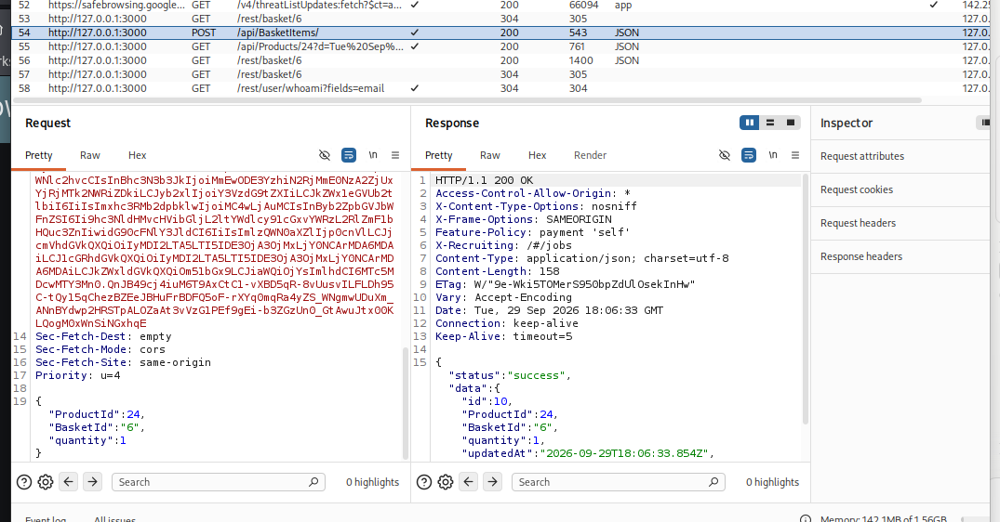

5. Enviar la petición y confirmar la respuesta `200 OK`, que indica que el producto fue agregado exitosamente al carrito de compras pese a no estar disponible en el catálogo visible.

  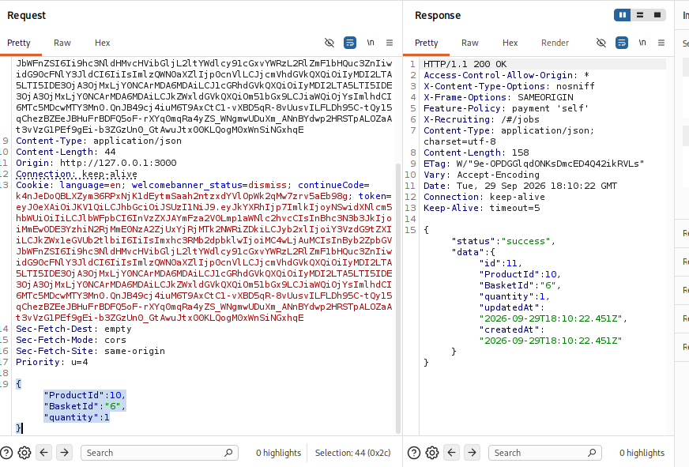

6. Completar el flujo de compra normalmente desde la interfaz: el producto "Christmas Super-Surprise-Box (2014 Edition)" ya figura en la cesta junto a los demás productos agregados.

  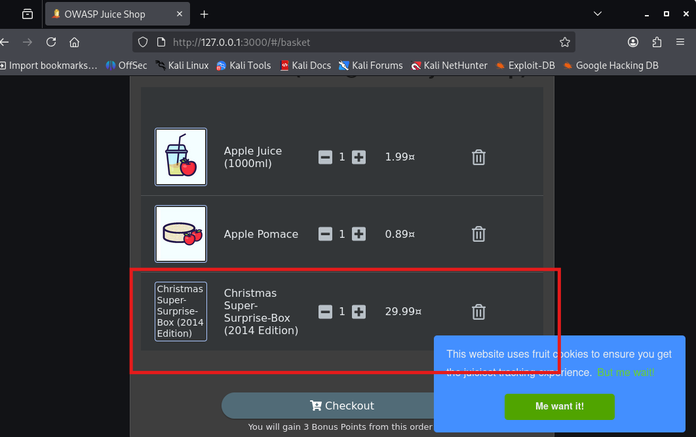

7. Finalizar el checkout. La aplicación confirma la compra y, junto con ella, la resolución del desafío "Christmas Special".

  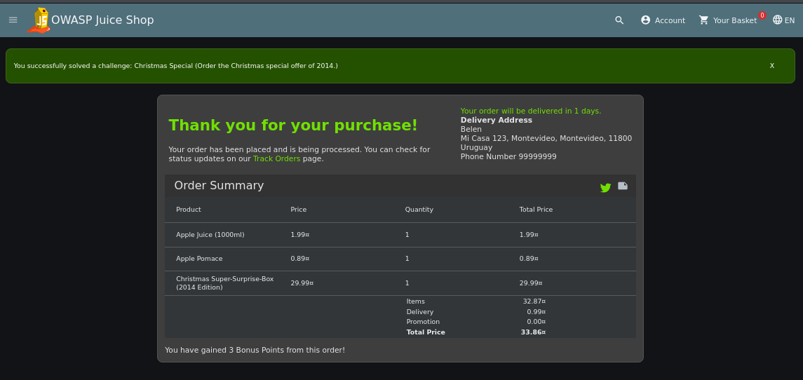

### Recomendaciones

La corrección de la causa raíz de esta vulnerabilidad es la misma que en J5, ya que se trata en el fondo de la misma inyección SQL sobre el buscador de productos: reemplazar la construcción de la consulta por sentencias parametrizadas, de forma que el parámetro `q` no pueda alterar la cláusula `WHERE` ni comentar el filtro `deletedAt IS NULL`. Sin embargo, este desafío también expone un problema adicional y distinto, más cercano al desafío de J6; aun si la inyección SQL se corrigiera, el endpoint `POST /api/BasketItems` sigue aceptando cualquier `ProductId` sin validar del lado servidor que el producto esté efectivamente disponible para la venta (por ejemplo, verificando que su `deletedAt` sea `null`), lo cual constituye una falla de control de acceso a nivel de negocio independiente de la inyección. 

Por eso, además de sanear la búsqueda, es necesario que el endpoint de agregar productos a la cesta valide explícitamente la disponibilidad del producto antes de aceptar la operación, y no solo su existencia por `id` en la base de datos. 

La diferencia con J4 es más de fondo: allí el problema es que el servidor confía en un campo (`role`) que el cliente no debería poder fijar en absoluto, mientras que acá el `ProductId` sí es un campo legítimo del lado del cliente. En este caso, el defecto es que el servidor no aplica sobre ese valor una regla de negocio (disponibilidad del producto) que sí debería controlar.

---
</div>

---
</div>

<!-- ============================================================ -->
<!-- Desafíos crAPI -->
<!-- ============================================================ -->

<div style="page-break-after: always;"></div>

<a name="desafíos-crapi"></a>

## Desafíos crAPI

Para esta parte, se explotarán y documentarán cinco debilidades representativas del OWASP API Security Top 10.

* [C1 - Find the location of another user's vehicle](#c1---find-the-location-of-another-users-vehicle)
* [C2 - Reset the password of a different user](#c2---reset-the-password-of-a-different-user)
* [C3 - Get an item for free](#c3---get-an-item-for-free)
* [C6 - NoSQL Injection](#c6---nosql-injection)
* [C7 - DoS](#c7---dos)

<div style="page-break-after: always;"></div>

<a name="c1---find-the-location-of-another-users-vehicle"></a>

## C1 - Find the location of another user's vehicle

### Descripción

El desafío consiste en obtener información sensible de ubicación (geolocalización) del vehículo de otro usuario de la plataforma.

### Clasificación OWASP Top 10 API

**API1:2023 – Broken Object Level Authorization (BOLA).** El endpoint que devuelve la ubicación de un vehículo confía en un identificador (VIN) provisto por el propio cliente, sin validar del lado servidor que ese vehículo pertenezca al usuario autenticado.

### Enfoque de explotación

> El entorno de crAPI se levanta siguiendo lo detallado en el [Práctico 1 (Paso 6)](https://github.com/belenkanas/dsws-practico1): se descarga el proyecto oficial de OWASP, se ejecuta `sudo docker-compose -f docker-compose.yml --compatibility up -d` parado en `~/crAPI-main/deploy/docker`, se verifica que todos los servicios estén en estado `Up` con `sudo docker-compose ps`, y se accede a la aplicación desde `http://localhost:8888`. crAPI también expone un servidor de correo de prueba (MailHog) en `http://localhost:8025`, necesario para completar el registro y la verificación de vehículos, ya que la aplicación no envía correos reales sino que los captura ahí.

1. Registrarse e iniciar sesión en crAPI (`http://localhost:8888`). Desde el *Dashboard*, seleccionar **Add a Vehicle** y completar el alta con el VIN y el PIN recibidos en MailHog (`http://localhost:8025`) tras el registro.

Para este caso, los datos obtenidos fueron:

```bash
Pincode: 0416
VIN: A443EP1392B76L52P
```

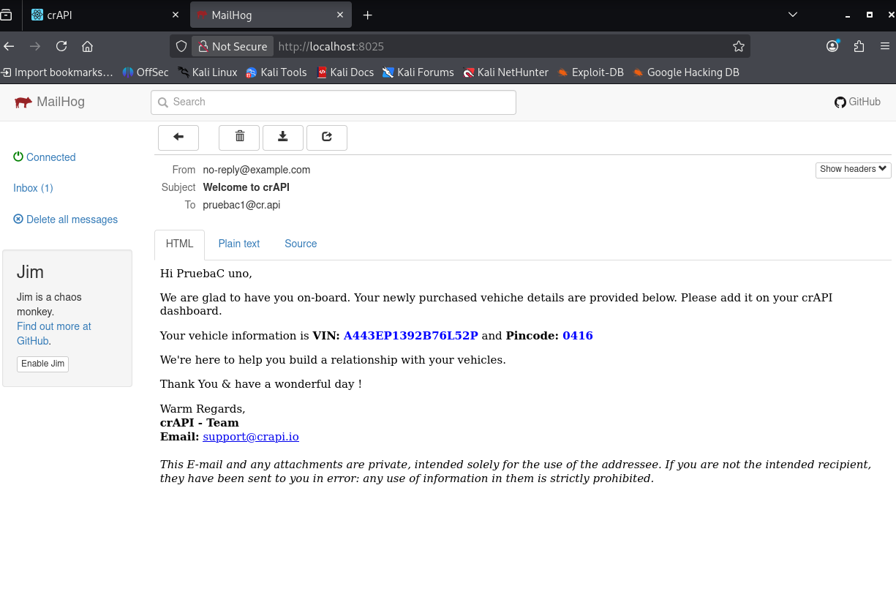

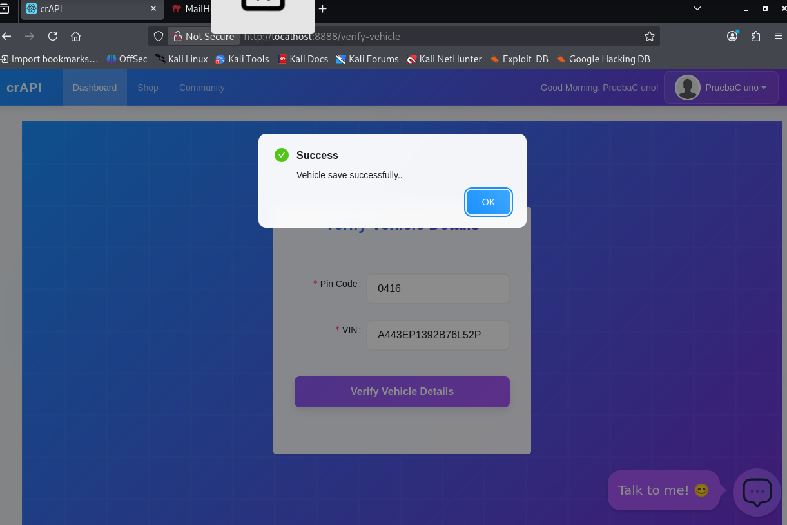

2. Una vez agregado el vehículo, el *Dashboard* muestra su información junto con un botón **Refresh Location**.

  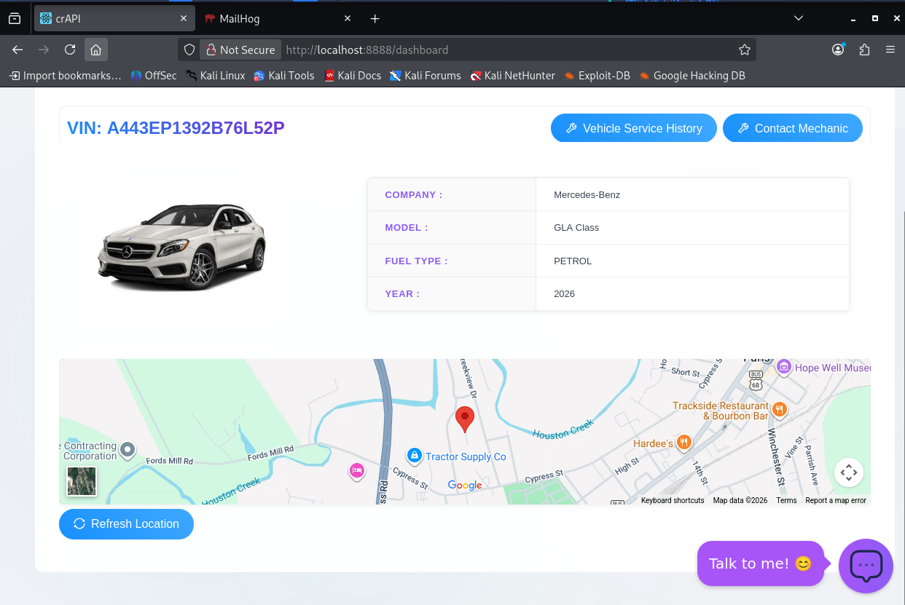

 Interceptar con Burp la petición que dispara dicho botón, para identificar el endpoint y el formato exacto de la petición: `GET /identity/api/v2/vehicle/<vehicleid>/location`, donde `<vehicleid>` es un UUID (no un número secuencial). Enviar esta petición a Repeater.

 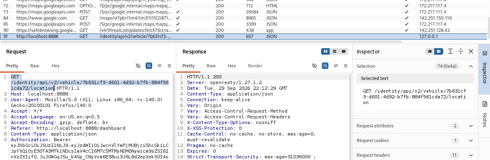
 
3. Obtener el `vehicleid` de otro usuario. Para esto, crAPI expone en la sección **Community** de la aplicación un foro donde los usuarios publican mensajes; el endpoint que alimenta esa sección, confirmado en el historial de Burp al navegar por dicha sección, es `GET /community/api/v2/community/posts/recent?limit=30&offset=0`, que devuelve, junto con cada publicación,  un objeto `author` con datos del usuario que la escribió, entre ellos su `vehicleid`. Se interceptan estas respuestas con Burp y se anota el `vehicleid` de algún otro usuario.

  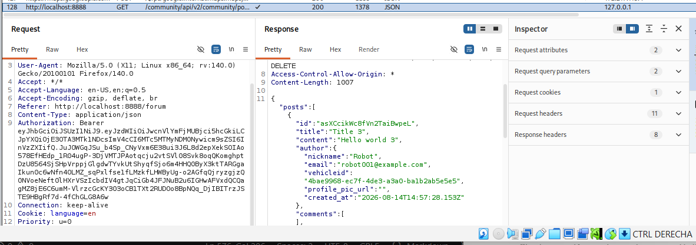

  En este caso, se usó la información del primer comentario del foro:

  ```json
  "author":{
    "nickname":"Robot",
    "email":"robot001@example.com","vehicleid":"4bae9968-ec7f-4de3-a3a0-ba1b2ab5e5e5","profile_pic_url":"","created_at":"2026-08-14T14:57:28.153Z"
  },
  ```

4. En Repeater, sobre la petición del paso 2, reemplazar el propio `<vehicleid>` en la URL por el UUID de la víctima obtenido en el paso anterior.

  La petición queda entonces: 
  
  `GET /identity/api/v2/vehicle/4bae9968-ec7f-4de3-a3a0-ba1b2ab5e5e5/location`


5. Reenviar la petición modificada y verificar en la respuesta (`200 OK`) que se obtienen las coordenadas (`latitude`/`longitude`) del vehículo ajeno, junto con datos adicionales del propietario (`fullName`, `email`), confirmando así el acceso no autorizado a información de otro usuario.

  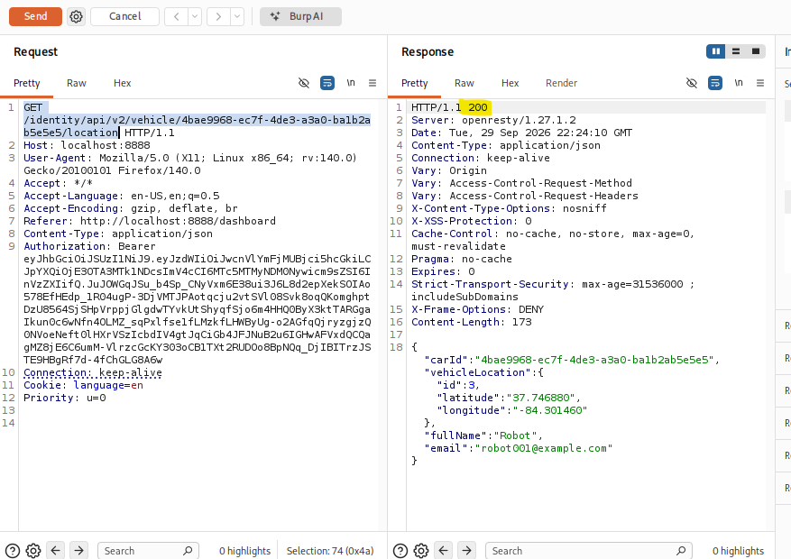


### Recomendaciones

Esta vulnerabilidad comparte la misma causa raíz que J6 (View Basket) en Juice Shop: en ambos casos el backend identifica un recurso mediante un identificador provisto por el propio cliente en la URL, sin verificar del lado servidor que ese recurso pertenezca al usuario autenticado que hace la petición; la diferencia es únicamente de contexto (una cesta de compras en Juice Shop, la ubicación de un vehículo en crAPI) y de que acá se usa un UUID en lugar de un ID numérico secuencial, lo cual complica un poco la enumeración pero no soluciona el problema de fondo. Por eso, la corrección es análoga: el endpoint `GET /identity/api/v2/vehicle/<vehicleid>/location` debería validar, antes de devolver la ubicación, que el `vehicleid` recibido esté asociado al usuario autenticado según su token, devolviendo un error de autorización (`403 Forbidden`) en caso contrario, en lugar de confiar únicamente en el UUID recibido en la ruta. Adicionalmente, conviene revisar el endpoint `GET /community/api/v2/community/posts/recent`, ya que constituye en sí mismo una exposición excesiva de datos (*excessive data exposure*): no debería incluir el `vehicleid` de los usuarios en la respuesta de un foro público, dado que esa información no es necesaria para la funcionalidad de comentarios y es precisamente la que permite identificar víctimas para explotar la falla de autorización.

---
</div>

<div style="page-break-after: always;"></div>

<a name="c2---reset-the-password-of-a-different-user"></a>

## C2 - Reset the password of a different user

### Descripción

El desafío consiste en forzar el cambio de contraseña de la cuenta de otro usuario, abusando del flujo de recuperación de contraseña basado en un código de verificación (OTP) de 4 dígitos.

### Clasificación OWASP Top 10 API

**API2:2023 – Broken Authentication.** El mecanismo de recuperación de contraseña presenta dos defectos independientes que permiten explotarlo: por un lado, el endpoint de verificación del OTP no ata la validación a la sesión o flujo del navegador que lo generó; por otro, una versión anterior de ese mismo endpoint, mantenida activa por compatibilidad, carece de límite de intentos, permitiendo obtener el OTP correcto por fuerza bruta sin necesidad de tener acceso al correo de la víctima.

### Enfoque de explotación

Se utilizan dos cuentas de prueba: la usada en desafíos anteriores y una segunda que simula la cuenta víctima.

```json
{
  "email": "pruebac1@cr.api",
  "password": "Hola2415!!"
}
```
```json
{
  "email": "pruebac2@cr.api",
  "password": "Chau2415!!"
}
```

**Hallazgo 1 — Falta de *binding* entre el OTP y la sesión que lo solicitó**

1. Disparar el flujo de "Forgot Password" desde la interfaz con el correo `pruebac1@cr.api`, generando la petición `POST /identity/api/auth/forget-password`.

   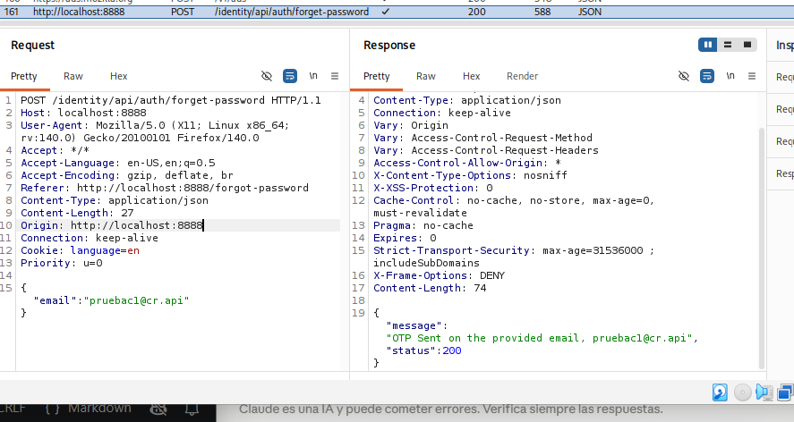

2. Desde Repeater, modificar el campo `email` de esa misma petición para dispararla también con `pruebac2@cr.api`, generando un segundo OTP independiente enviado al correo de la cuenta víctima.

   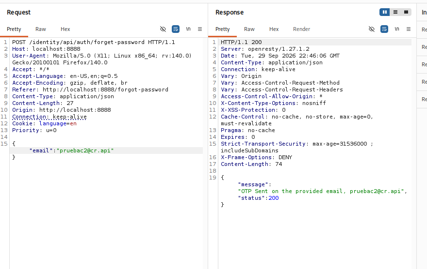

3. Intentar completar el reseteo desde la propia interfaz web usando el OTP recibido por `pruebac2` (`4160`). La operación falla con el mensaje *"Invalid OTP! Please try again"*, porque el formulario web mantiene internamente el correo con el que se inició el flujo (`pruebac1`) y lo envía automáticamente en la petición de confirmación (`POST /identity/api/auth/v3/check-otp`), sin que el usuario pueda verlo ni modificarlo desde la interfaz.

   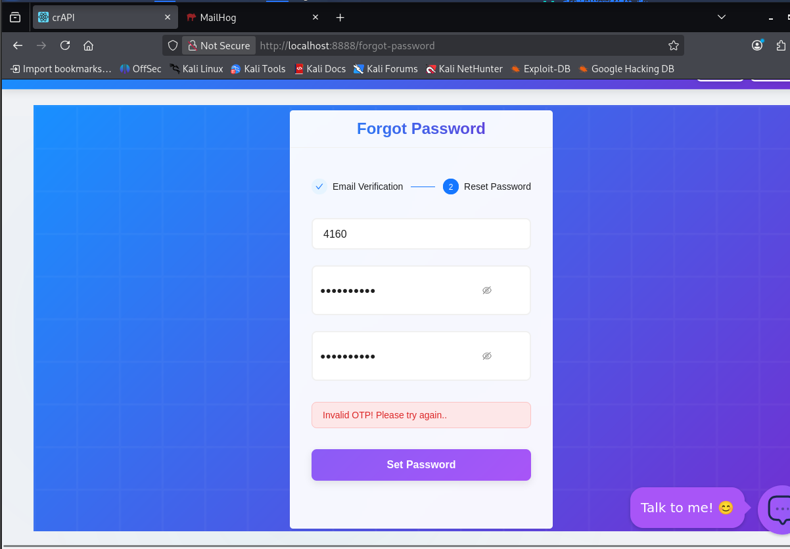

4. Interceptar esa petición con Burp y, desde Repeater, modificar manualmente el campo `email` del cuerpo JSON a `pruebac2@cr.api`, dejando intacto el OTP (`4160`) y la nueva contraseña. Esto demuestra que el endpoint `check-otp` no valida que la petición provenga de la misma sesión o flujo del navegador que originalmente solicitó ese OTP: simplemente verifica si la combinación `email` + `otp` es válida en la base de datos.

   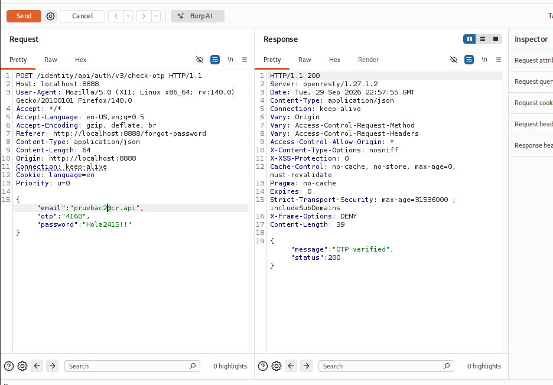

   La respuesta `200 OK` con el mensaje `"OTP verified"` confirma que la contraseña de la cuenta víctima fue modificada.

5. Confirmar el compromiso iniciando sesión con `pruebac2@cr.api` y la nueva contraseña.

   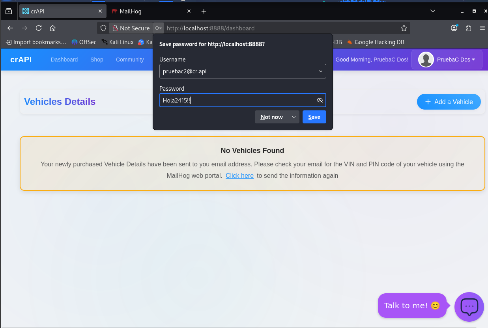

   > **Aclaración:** en este ejercicio ambas cuentas son controladas por la misma persona, por lo que el acceso al OTP de la "víctima" vía MailHog no representa, por sí mismo, una falla explotable por un atacante externo. Lo que sí queda demostrado es que el servidor no ata la verificación del OTP a la sesión que lo solicitó, permitiendo completar el reseteo para cualquier correo mediante una llamada directa a la API en tanto se disponga de un OTP válido para esa cuenta.

**Hallazgo 2 — Falta de límite de intentos en una versión anterior del endpoint**

Frente al punto anterior se observa una vulnerabilidad puntual: ¿cómo obtendría un atacante real el OTP de la víctima, sin acceso a su correo? La respuesta es que no necesita adivinarlo por otros medios; puede obtenerlo por fuerza bruta, ya que una versión anterior del endpoint de verificación no tiene protección contra intentos repetidos.

6. Disparar nuevamente "Forgot Password" para `pruebac2@cr.api`, generando un nuevo OTP que, a los fines de esta prueba, no se consulta en MailHog.

7. Enviar repetidamente a `POST /identity/api/auth/v3/check-otp` un body con un OTP incorrecto (`{"email":"pruebac2@cr.api","otp":"0000","password":"NuevaClave123!"}`). Tras algunos intentos, el servidor responde con un error de límite excedido (`"You've exceeded the number of attemps."`) en lugar de `"Invalid OTP"`, confirmando que la versión `v3` sí implementa *rate limiting*.

  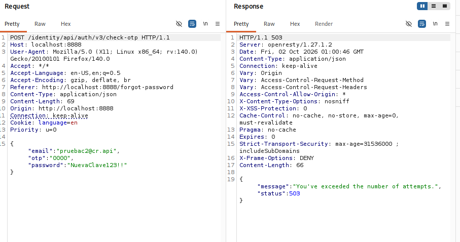

8. Repetir el mismo body contra `POST /identity/api/auth/v2/check-otp` (misma ruta, cambiando solo la versión). A diferencia de `v3`, esta versión no bloquea los intentos repetidos, sin importar cuántos se envíen.

9. Enviar esa petición a Burp Intruder (`Ctrl + I`), marcando el OTP como posición de ataque (`"otp":"§0000§"`), ataque tipo **Sniper** y un payload numérico (`Payload type: Numbers`) de `0000` a `9999` (con relleno de ceros a la izquierda).

  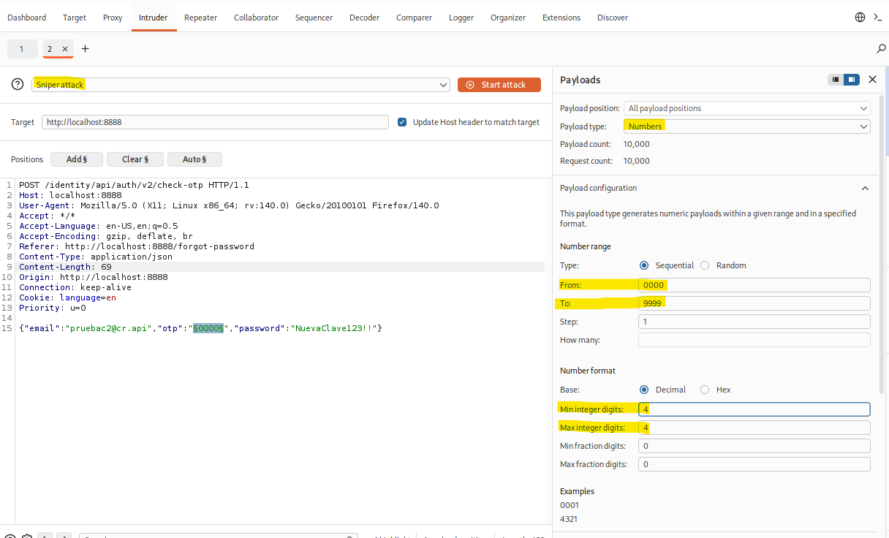

10. Iniciar el ataque y ordenar los resultados por longitud de respuesta (columna *Length*): la única fila cuya respuesta difiere del resto (mensaje `"OTP verified"` en lugar del error de OTP inválido) corresponde al código correcto.

  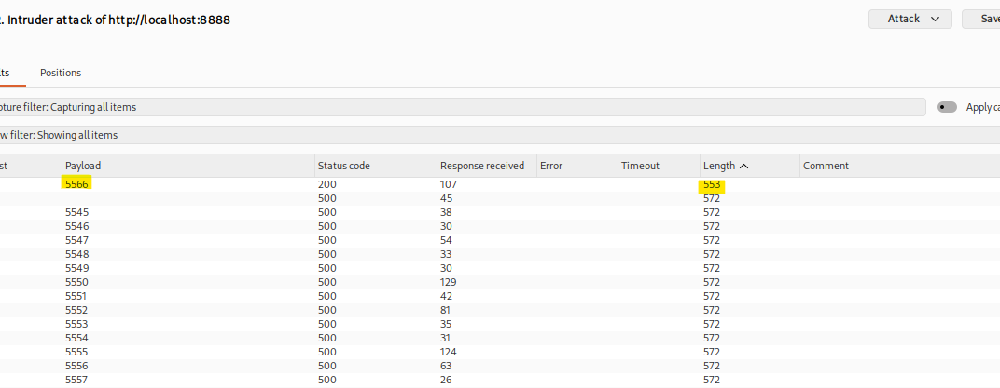

  Para este caso, el OTP correcto era `5566`. Esto se pudo observar debido a que el mensaje de error tiene una logitud de 572 caracteres, mientras que la de éxito tiene 553.

11. Confirmar el compromiso iniciando sesión con `pruebac2@cr.api` y la nueva contraseña forzada por este método.
  
  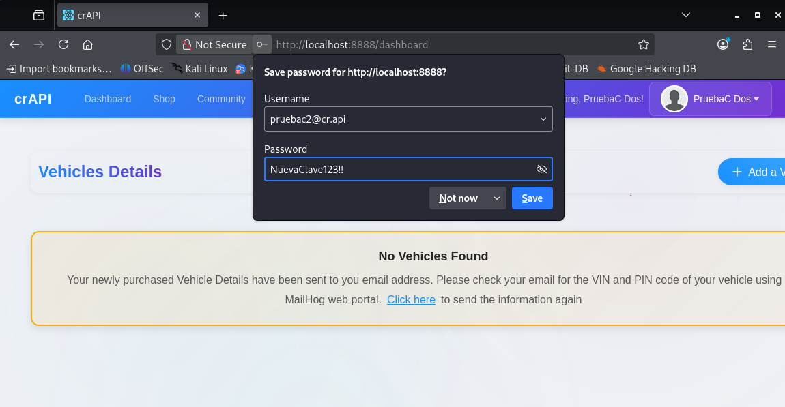

   > **Aclaración:** a diferencia del Hallazgo 1, este método no requiere en ningún momento consultar el correo de la víctima, por lo que sí es representativo de un ataque ejecutable por un tercero externo sin ningún tipo de acceso previo a la cuenta objetivo, más allá de conocer su dirección de correo.

### Recomendaciones

La corrección de esta vulnerabilidad requiere atender ambos defectos de forma independiente. Para el primero, el servidor debería vincular cada OTP emitido a la sesión, cookie o token temporal que inició el flujo de recuperación, de modo que un OTP válido para una cuenta no pueda utilizarse en una petición de confirmación que especifique un correo distinto al que originó esa solicitud. Para el segundo, es fundamental retirar de producción las versiones antiguas de la API una vez que sus reemplazos entran en vigencia, o al menos garantizar que todas las versiones activas de un mismo endpoint reciban las mismas medidas de seguridad; en particular, el endpoint de verificación de OTP debería limitar la cantidad de intentos fallidos por cuenta en una ventana de tiempo (o bloquear la cuenta temporalmente tras varios intentos), independientemente de la versión de API utilizada para acceder a él. De forma más general, conviene además usar OTP de mayor longitud o con mayor entropía, y hacerlos expirar rápidamente, de modo que aun sin límite de intentos la ventana de explotación por fuerza bruta sea mínima.

---
</div>

<div style="page-break-after: always;"></div>

<a name="c3---get-an-item-for-free"></a>

## C3 - Get an item for free

### Descripción

El desafío consiste en obtener un producto sin costo real: comprarlo, "devolverlo" únicamente a nivel de API (sin generar ni presentar el código QR que exige el proceso real de devolución) y recibir igualmente el reembolso correspondiente, quedándose tanto con el producto como con el dinero.

### Clasificación OWASP Top 10 API

**API3:2023 – Broken Object Property Level Authorization**, en su variante de *Mass Assignment* (categoría que en la edición 2019 del OWASP API Security Top 10 figuraba de forma independiente como `API6:2019 – Mass Assignment`, y que en la edición 2023 fue fusionada junto con la exposición excesiva de datos dentro de esta categoría más amplia). El endpoint que gestiona el detalle de una orden acepta el método `PUT` y permite que el cliente modifique directamente la propiedad `status` del objeto orden, sin restringir qué transiciones de estado son legítimas ni exigir que ese cambio sea consecuencia de un proceso interno verificado (la inspección física de la devolución), en lugar de una simple petición HTTP del usuario.

### Enfoque de explotación

1. Realizar una compra desde la sección **Shop** de crAPI y capturar con Burp la petición `POST` correspondiente, para analizar los parámetros de producto y cantidad en su cuerpo, así como el saldo resultante en la respuesta.

   > **Anotación:** el saldo inicial de la cuenta es de $100.

   En este caso se simuló la compra del producto `Wheel`, de $10.00. El endpoint de la compra es `POST /workshop/api/shop/orders`, con el siguiente cuerpo:

```json
   {
     "product_id": 2,
     "quantity": 1
   }
```

   La respuesta confirma la operación y el nuevo saldo:

```json
   {
     "id": 35,
     "message": "Order sent successfully.",
     "credit": 90.0
   }
```

   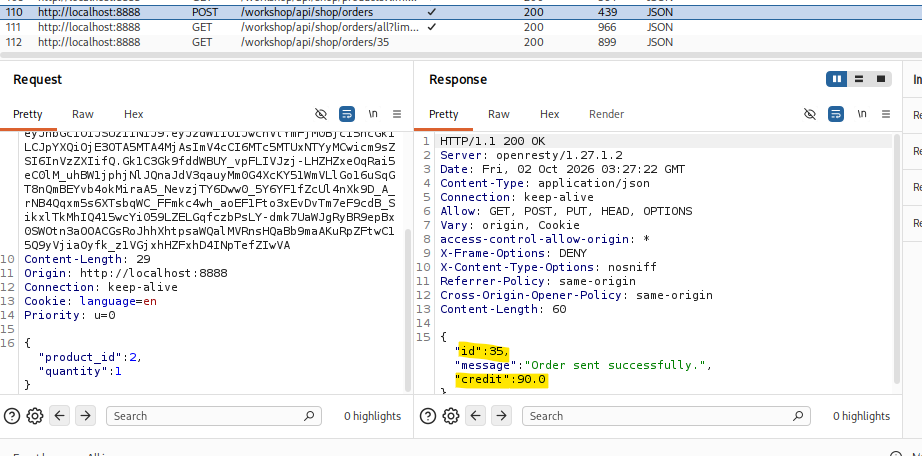

2. Desde **Past Orders** (sección donde se listan las órdenes pasadas), abrir el detalle de la orden recién creada. Esto dispara `GET /workshop/api/shop/orders/<orderId>`, donde `<orderId>` es el ID numérico de la orden (en este caso, `35`). En la respuesta, el campo `status` figura como `"delivered"`.

   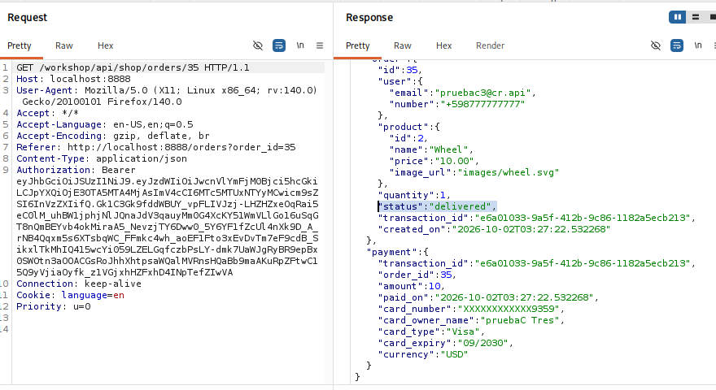

3. Enviar esa petición a **Repeater** y cambiar el método de `GET` a `PUT` sobre la misma URL (`/workshop/api/shop/orders/<orderId>`), dejando el body vacío o con un valor inválido en `status` a propósito, para forzar un mensaje de error.

   El servidor devuelve un mensaje de validación que revela explícitamente los valores permitidos para ese campo (`delivered`, `return pending`, `returned`), confirmando así que el endpoint acepta `PUT` y que `status` es un campo editable por el cliente, cuando en una implementación correcta este cambio debería ser consecuencia de un proceso interno (la verificación física de la devolución) y no de una petición directa del usuario.

   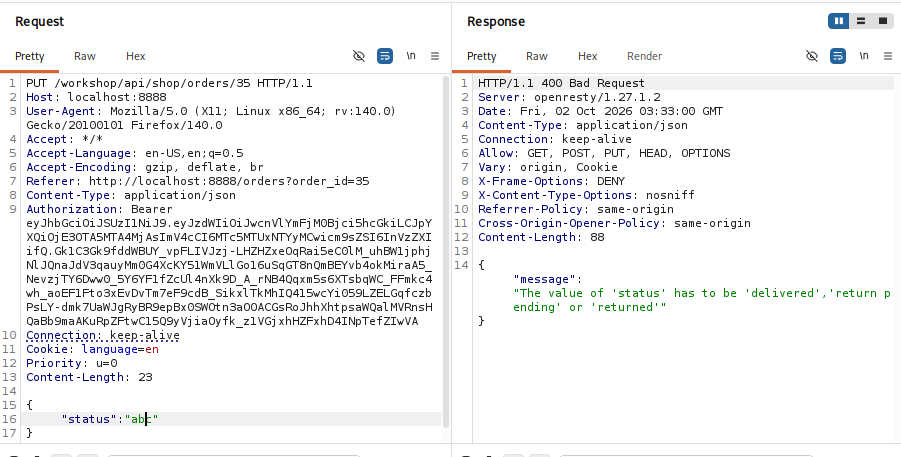

4. Con esa información, armar la petición definitiva:

```
   PUT /workshop/api/shop/orders/<orderId>
```
```json
   {
     "status": "returned"
   }
```
   Con esto se salta directamente al estado final (`returned`), sin pasar por `return pending` ni por ningún paso intermedio de verificación.

5. Enviar la petición y confirmar en la respuesta (`200 OK`) que el `status` de la orden quedó efectivamente en `"returned"`.

   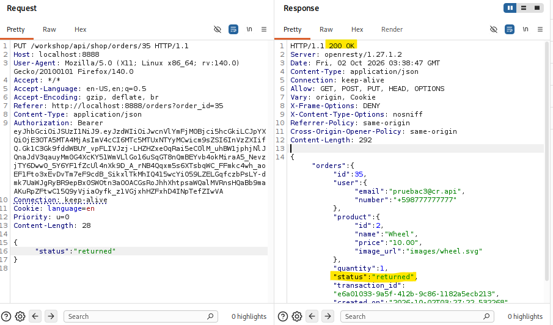

6. Verificar en la sección **Shop** que el saldo volvió a subir en el monto del producto comprado ($10, pasando de $90 nuevamente a $100), es decir, se reembolsó el dinero sin que se haya generado ni presentado en ningún momento el código QR que exige el proceso legítimo de devolución, y sin haber entregado el producto físicamente.

   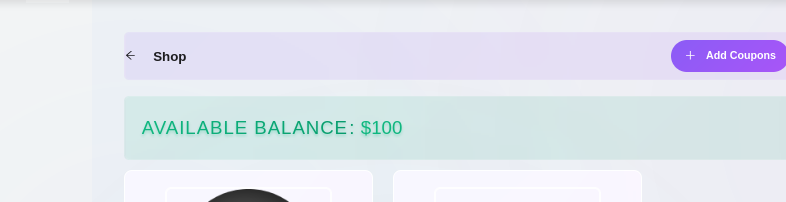

   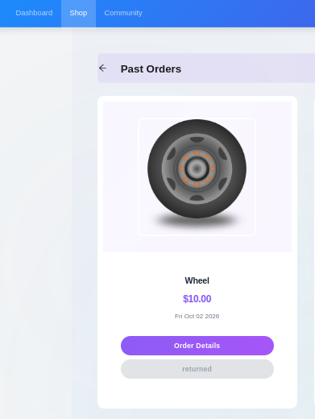

### Recomendaciones

La corrección de esta vulnerabilidad requiere, en primer lugar, que el campo `status` de una orden deje de ser una propiedad editable directamente por el cliente a través del endpoint `PUT /workshop/api/shop/orders/<orderId>`; en su lugar, el backend debería definir explícitamente qué campos puede modificar un usuario autenticado (por ejemplo, iniciar una solicitud de devolución) y cuáles son de uso exclusivamente interno (como el estado final `returned`, que solo debería poder fijar un proceso o un rol administrativo tras verificar la devolución física), descartando cualquier intento del cliente de escribir sobre estos últimos en lugar de aceptarlos sin más. Esta distinción es la medida central porque ataca directamente la causa raíz del mass assignment: el problema no es que exista un campo `status`, sino que el servidor confía en que cualquier valor recibido en el cuerpo de la petición es legítimo, sin importar quién lo envía. 

Además, conviene modelar explícitamente la máquina de estados del proceso de devolución (`delivered` --> `return pending` --> `returned`) y validar del lado servidor que una orden solo pueda transicionar entre estados consecutivos y en el orden correcto, de forma que no sea posible saltar directamente de `delivered` a `returned` sin pasar por `return pending` ni por la verificación asociada. Esto es relevante incluso si se restringe qué campos puede tocar el cliente, porque sin esta validación de flujo alguien con permisos legítimos para solicitar una devolución (algo normal) igual podría intentar forzar el estado final sin que medie ninguna inspección real del producto. 

Por último, es recomendable evitar que mensajes de error expongan los valores internos permitidos para un campo sensible (como ocurrió al enviar un `status` inválido), ya que esa información, aunque secundaria, facilitó precisamente el descubrimiento de los estados válidos y aceleró la explotación de la falla principal.

---
</div>

<div style="page-break-after: always;"></div>

<a name="c6---nosql-injection"></a>

## C6 - NoSQL Injection

### Descripción

El desafío consiste en obtener cupones de descuento válidos sin conocer un código real, explotando una inyección en la consulta que valida el cupón contra la base de datos NoSQL (MongoDB).

### Clasificación OWASP Top 10 API

**API8:2019 – Injection**, categoría explícita en la edición 2019 del OWASP API Security Top 10 (en la edición 2023 el aspecto de validación insegura de la entrada se asocia principalmente a **API8:2023 – Security Misconfiguration**). El parámetro que recibe el código de cupón se pasa directamente a una consulta MongoDB sin sanitizar, permitiendo inyectar operadores propios de NoSQL en lugar de una cadena literal.

### Enfoque de explotación

1. Desde la sección **Shop** de crAPI, ir a la opción de aplicar un cupón ("Add Coupon") e ingresar cualquier código de prueba (por ejemplo, unos caracteres al azar) para interceptar con Burp la petición que dispara la validación. El endpoint identificado es `POST /community/api/v2/coupon/validate-coupon`, con un cuerpo de la forma:

   ```json
   {
     "coupon_code": "ABC123"
   }
   ```

   Enviar esta petición a Repeater.

  Al enviar un código inexistente como cadena de texto, el servidor responde con un mensaje indicando que el cupón es inválido (`"Invalid Coupon Code"`), confirmando que, en condiciones normales, hace falta conocer un código real y existente en la base de datos.

  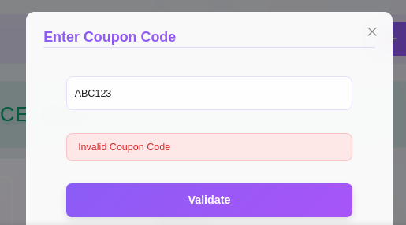
  
2. En lugar de enviar una cadena de texto en `coupon_code`, reemplazar su valor por un objeto con un operador de MongoDB, que es lo que efectivamente recibe la consulta sin que el backend valide que el tipo de dato sea el esperado (un string). El payload utilizado es:

   ```json
   {
     "coupon_code": { "$ne": "" }
   }
   ```

   El operador `$ne` (*not equal*) le indica a MongoDB que traiga cualquier documento cuyo campo `coupon_code` sea distinto de una cadena vacía, es decir, prácticamente cualquier cupón existente en la colección, sin necesidad de indicar ninguno en particular.

3. Enviar la petición modificada y verificar que la respuesta ya no indica un error de cupón inválido, sino un `200 OK` confirmando que el cupón fue validado correctamente, junto con los datos del cupón real que la inyección trajo de la base de datos (código y monto de descuento).

  En este caso, la información brindada fue:

  ```json
  {
    "coupon_code": "TRAC075"
  }
  ```

  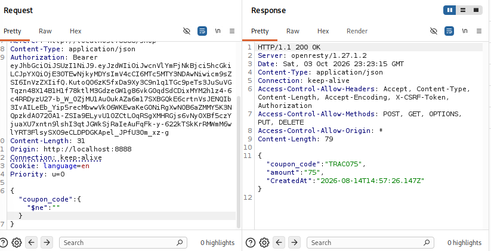

4. Aplicar dicho cupón en el checkout de la tienda y confirmar que el descuento se refleja efectivamente en el monto a pagar, demostrando el impacto completo de la vulnerabilidad.

  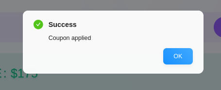

  Como se puede observar, el resultado de aplicar el cupón genera una suma de $75 al saldo disponible del usuario.

  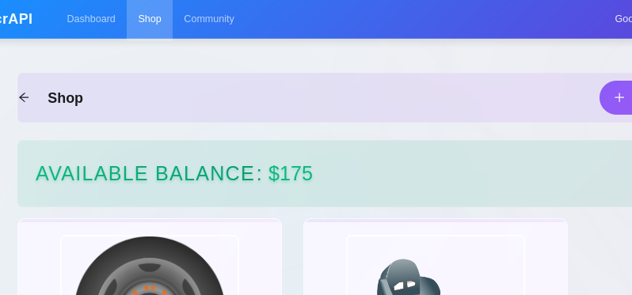

### Recomendaciones

La corrección de fondo de esta vulnerabilidad consiste en validar y forzar el tipo de dato del campo `coupon_code` del lado servidor antes de usarlo en cualquier consulta, rechazando la petición (por ejemplo, con un `400 Bad Request`) si el valor recibido no es una cadena de texto simple; esta medida ataca directamente la causa raíz, ya que todo el ataque fue posible porque el backend aceptó sin cuestionar un objeto JSON (`{ "$ne": "" }`) en un campo que debía ser un string, permitiendo que ese objeto se interpretara como un operador de consulta de MongoDB en lugar de como un valor literal a comparar. 

A esto conviene sumar el uso de un esquema de validación de entrada que defina explícitamente la forma esperada del cuerpo de la petición para este endpoint, de modo que cualquier estructura que no coincida sea descartada antes de llegar a la capa de acceso a datos. También es recomendable evitar construir la consulta a MongoDB pasando directamente el valor recibido del cliente como parte del filtro (`bson.M{"coupon_code": coupon_code}` con el dato crudo), y en su lugar sanitizar o escapar cualquier clave que comience con `$` o contenga un punto (`.`), ya que esos caracteres son los que MongoDB interpreta como operadores u operaciones sobre subdocumentos. 

Finalmente, conviene aplicar el principio de mínimo privilegio sobre la validación de cupones en sí: dado que el payload utilizado devolvió un cupón real y válido aun sin conocer su código, el diseño debería evitar que una simple validación exponga los datos completos del cupón (código y monto) en la respuesta, y en su lugar limitarse a confirmar si el cupón ingresado específicamente es válido o no, sin revelar información adicional que no fue solicitada por quien hace la consulta.

---
</div>

<div style="page-break-after: always;"></div>

<a name="c7---dos"></a>

## C7 - DoS

### Descripción

El desafío consiste en provocar una denegación de servicio de capa 7 (aplicación) utilizando la funcionalidad de "contact mechanic".

### Clasificación OWASP Top 10 API

**API4:2023 – Unrestricted Resource Consumption.** El endpoint que procesa el mensaje al mecánico no implementa límites de frecuencia (*rate limiting*) ni de tamaño de payload, y dispara una operación costosa en el backend en cada invocación.

### Enfoque de explotación

1. Capturar con Burp la petición `POST` correspondiente al envío de un mensaje de contacto al mecánico.
2. Identificar si el cuerpo de la petición admite payloads de gran tamaño (por ejemplo, un campo de texto sin límite definido) y si existe algún control de frecuencia de envíos.
3. Automatizar el reenvío masivo de dicha petición, eventualmente con payloads de gran tamaño, utilizando herramientas como Burp Intruder o un script propio.
4. Monitorear el estado del servicio (tiempos de respuesta, disponibilidad, uso de recursos) para verificar la degradación o caída provocada.

### Recomendaciones

Algunas recomendaciones para la corrección de dicha vulnerabilidad podría incluir...

---
</div>

---
</div>

</div>

<div style="page-break-after: always;"></div>

<a name="conclusiones"></a>

## Conclusiones

---
</div>

> Belén Kanas | Práctico 3 - OWASP Juice Shop y OWASP crAPI | Desarrollo de Software Seguro 2026
